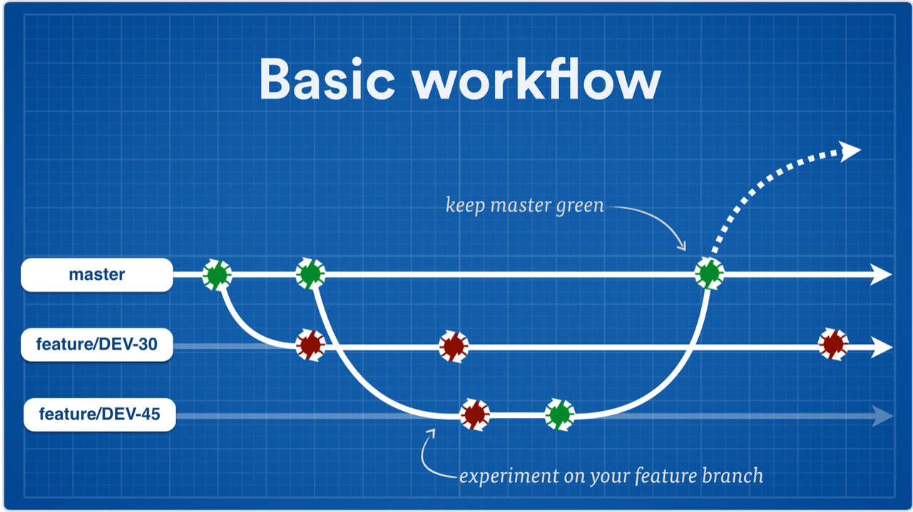
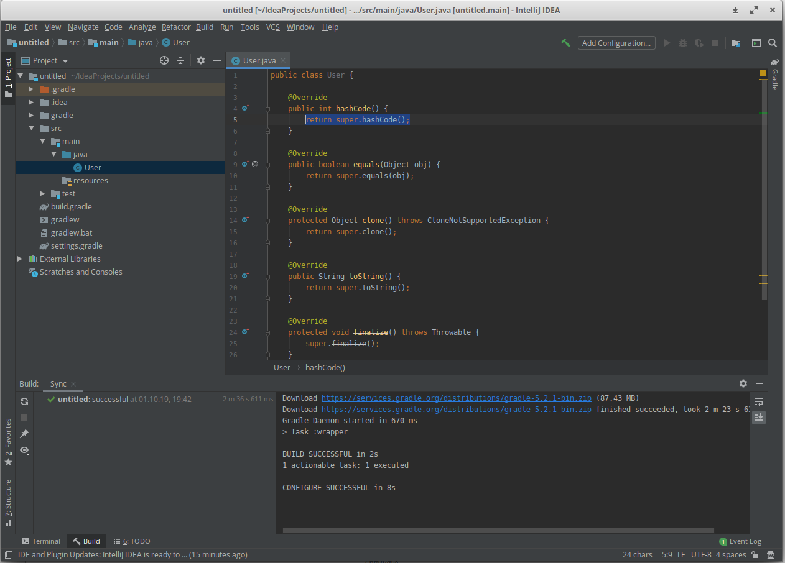

---
title: 'Modul: Fortgeschrittene Programmierkonzepte (FPK)'
subtitle: '01-Einführung'
author: 'Dozent: Prof. Dr. Marcel Tilly'
institute: 'Bachelor Informatik, Fakultät für Informatik'
...
---
class: title-slide  

# Modul- Fortgeschrittene Programmierkonzepte
### Bachelor Informatik

## 01-Einführung
### Prof. Dr. Marcel Tilly
Fakultät für Informatik, Cloud Computing

---

# Organisatorisches

- Material:
	- https://hsro-inf-fpk.github.io (fork von https://hsro-inf-prg3.github.io)
	- Github Organization: https://github.com/hsro-inf-fpk
	- Slides, Skript, Übungen ...in Englisch! &#x263A;
	- Learning Campus: Einschreiben unter **Fortgeschrittene Programmierkonzepte (INF-B3), WiSe19/20** (Selbsteinschreibung ohne Schlüssel!)

- Vorlesung: Mittwochs,  08:00 - 09:30 in **R0.03**
- Übungen: 
	- Tutor: ???
	- Mittwochs, 2./3./4. Stunde, **S1.31**
	- Gruppenwahl über Learning Campus

- [Mattermost](https://inf-mattermost.fh-rosenheim.de/inf-fpk-wise20/channels/town-square)([einschreiben](https://inf-mattermost.fh-rosenheim.de/signup_user_complete/?id=mdkk585s8fytfkz37m5owr39ke))

**WICHTIG: Materialien auf Englisch, Vorlesung aber auf Deutsch.**

---

# Leistungsnachweis

### Klausur!

- schriftliche Prüfung (SP, 90 Minuten) am Ende des Semesters
- erlaubt ist ein Buch mit ISBN Nummer
- Anmeldung über OSC

- Was kommt dran?
	- Alles was in der Vorlesung dran war!

---

# Lernziele

### Aus dem Modulhandbuch

Die Studierenden ...
- ... **vertiefen** ihre Kenntnisse in der objektorientierten Programmierung am Beispiel einer geeigneten Programmiersprache (hier: Java!)
- ... können die Möglichkeiten und Gefahren der objektorientierten Programmierung **beurteilen**.
- ... **sind befähigt**, alle wichtigen Programmierkonzepte für das Programmieren im Großen im Sinne der Komponentenorientierung anzuwenden.
- ... **erarbeiten sich die Grundlagen** der funktionalen Programmierung und deren Anwendungsgebiete.

---

# Review

## Programmieren 1

- Imperative Programmierung in C
- Constants, Variables, Expressions, Functions, I/O
- Datenstrukturen (fields, arrays, lists)
- Pointer &#x263A;

--

## Programmieren 2 (OOP)

- Objekt-orierntierte Programmierung (OOP) in Java
- Klassen und Objekte
- Interfaces und Vererbung
- Fehlerbehandlung via Exceptions

---

# Agenda für FPK

See https://hsro-inf-fpk.github.io/

---

# Agenda für heute

0. _Inform:_ 
	Your trusted advisors: [Google](https://google.com) -- [SO](https://stackoverflow.com) -- [Java Docs](https://docs.oracle.com/javase/8/docs/) -- [Google Translate](https://translate.google.com/)

1. _Memorize:_ 
	The git version control system (https://git-scm.com/)

2. _Automate:_ 
	The Gradle build tool (https://gradle.org/)

3. _Organize:_ 
	The IntelliJ IDEA (https://www.jetbrains.com/idea/)

4. _(Optional) Collaborate_ 
	Practice cross-repository pull requests and learn about _continuous integration_ (https://travis-ci.org/)

SO = stackoverflow

---

# Version Control

## Git

- Git is a distributed version-control system for tracking changes in source code during software development.
- It is designed for coordinating work among programmers, but it can be used to track changes in any set of files
- [Git](https://git-scm.com) is the _de-facto_ state of the art [version control system](https://en.wikipedia.org/wiki/Version_control).
- Some of you might remember [CVS (concurrent versions system)](http://savannah.nongnu.org/projects/cvs) or [subversion](https://subversion.apache.org/).
- Generally speaking, you should always use a version control system (VCS) when working on code, so you can keep track of changes.
- Print and laminate: https://services.github.com/on-demand/downloads/github-git-cheat-sheet.pdf
- For the more visual: http://ndpsoftware.com/git-cheatsheet.html
- If you run into a mess (and you will): http://justinhileman.info/article/git-pretty/git-pretty.png

---

# Git and feature branches

https://www.atlassian.com/continuous-delivery/continuous-delivery-workflows-with-feature-branching-and-gitflow

.center[]

- Git Guide: https://rogerdudler.github.io/git-guide/
- Git != GitHub

---

# Automate

### The Gradle Build Tool (GBT)

Gradle is an open-source build-automation system that builds upon the concepts of Apache Ant and Apache Maven and introduces a Groovy-based domain-specific language instead of the XML form used by Apache Maven for declaring the project configuration.

.center[]
.center[https://gradle.org]

- `gradle init --type java-application` to bootstrap a project
- `./gradlew build` to use the [Gradle wrapper](https://docs.gradle.org/current/userguide/gradle_wrapper.html) to be independent of locally installed Gradle
- `apply plugin: 'eclipse'` and `./gradlew eclipse` to generate Eclipse project files
- `apply plugin: 'idea'` and `./gradlew idea` to generate IntelliJ files (note: these are file-based project descriptions, not the new directory based `.idea/*`)

---

# IntelliJ

.center[https://www.jetbrains.com/idea/]

.center[]
---

# Collaborate

### Travis CI

Travis CI is a hosted continuous integration service used to build and test software projects hosted at GitHub. Travis CI provides various paid plan for private projects, and a free plan for open source.

- Collaboration means splitting the work
- Teamwork means working together
- Use feature branches and automated tests (JUnit)
- Use automated build and test runner

---

# Summary

- We will look into advanced programming concepts in Java (starting next week!)
- We will use professional software engineering tools
	- Git
	- IntelliJ Idea
	- Gradle
	- Travis CI

- Let's try to have fun!
