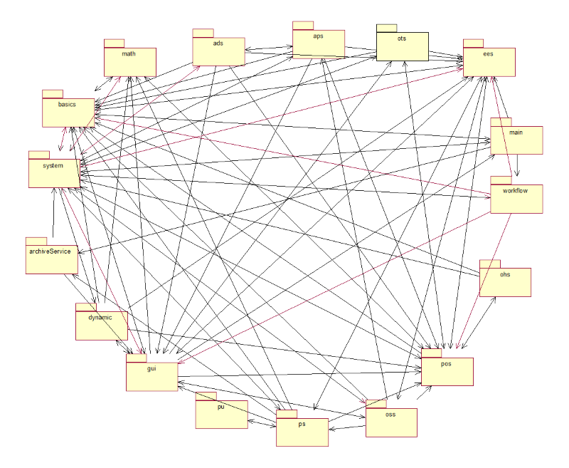
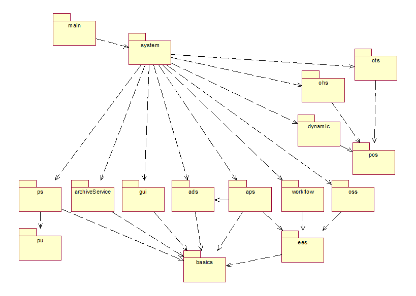
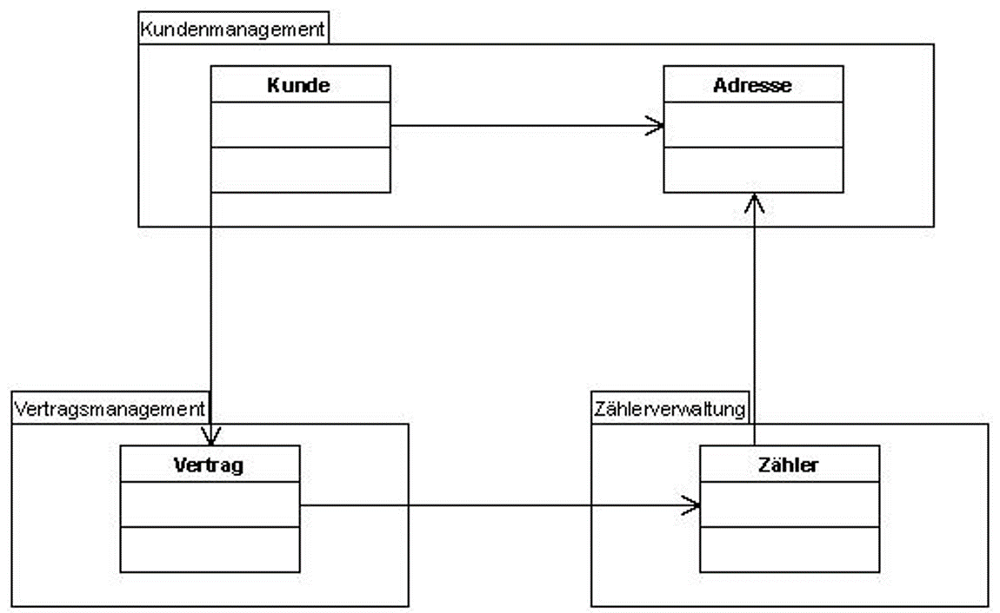
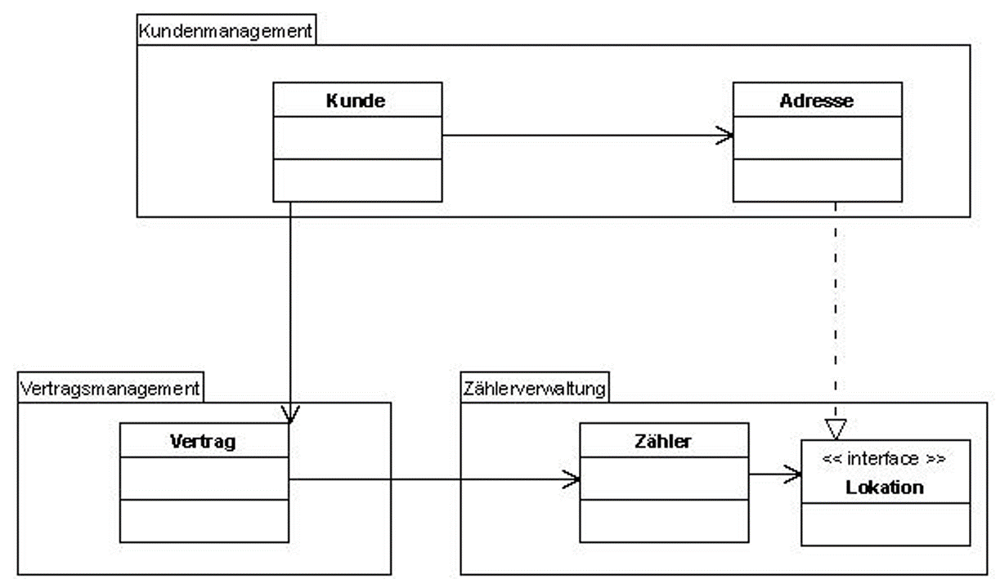
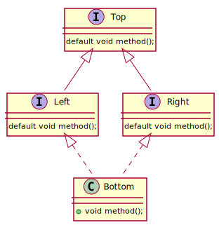
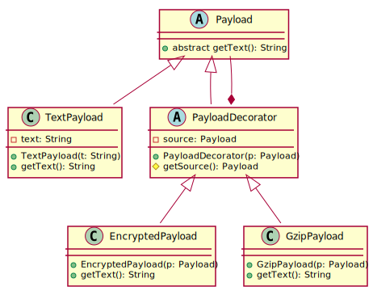

class: title-slide  

# Modul - Fortgeschrittene Programmierkonzepte
### Bachelor Informatik

## 03 - Inheritance
### Prof. Dr. Marcel Tilly
Fakultät für Informatik, Cloud Computing


---

# Agenda: Inheritance

- extending classes vs. implementing interfaces
- abstract classes
- final classes and methods
- inheritance and shadowing
- multiple inheritance
- the diamond problem
- decorator pattern

---

# Where did we start?

We looked at ...

- classes and interfaces (foremost) in the context of information hiding and encapsulation
    - packages and modules
    - usage of public interfaces 
    - scope and visibility of classes 
    - accessability to implement functionality

---

# Bad Design

.center[]

---

# Better ?

.center[]

- Defined dependencies
- Defined responsibilities
- Clear build process

---

# What is the problem?

.center[]

- Circular dependency
- Packaging is making it worth

---

# Packaging

.center[]

- Interfaces can help to decouple packages
- Think about where to place things!
- The bigger the system the more complicated 

---

# Classes vs. Implementing

Although similar from a technical point of view, extending classes and implementing interfaces are two very different concepts.

Consider the following example, which makes use of both.

```java
class Shape {
	private int x, y;
	Shape(int x, int y) {
		this.x = x;
		this.y = y;
	}
}
```
```java
interface Drawable {
	void draw(Canvas c);
}
```

---

# Implements vs. Extends

```java
class Rectangle extends Shape implements Drawable {
	private int width, height;
	Rectangle(int x, int y, int w, int h) {
		super(x, y);
		width = w;
		height = h;
	}
	public void draw(Canvas c) { /* do some magic */ }
}
```

- The `Rectangle` literally `extends` a general `Shape`: aside from `x` and `y` coordinates, it is defined by `width` and `height`.

- The `Rectangle` also `implements Drawable`: given some `Canvas`, it can draw itself.

---

# When to use what?

Following the semantics of the keywords, you should

- _extend_ a class, when you aim to make something more specific; a `Rectangle` will always be a `Shape`.
- _implement_ an interface, when you aim to extend a class by certain (potentionally orthogonal) functionality; not every `Shape` might be drawable, and there might be other classes which happen to be drawable.

---

# Abstract classes

Sometimes, it makes sense to enforce that subclasses implement certain methods.

Example: 

- Every shape will cover a certain surface
- But, different shapes will have different ways to compute that.


```java
abstract class Shape {
	// ...
	public abstract double surface();  // no method body!
}
```
```java
class Rectangle extends Shape {
	// ...
	public double surface() {
		return width * height;
	}
}
```

---

# Abstract Classes: Original

Why would you use abstract classes to begin with?

Example: 

- Insert entities into a database
- Need to create SQL INSERT statements

```java
interface DBItem {
    String makeInsertSQL();
}
```

---

# Subclasses

Example: Insert a student or an FWPM

```java
class Student implements DBItem {
    private String name;
    private int matrikel;
    public String makeInsertSQL() {
        return "INSERT INTO student (name, matrikel) VALUES (" 
            + name + ", " + matrikel + ")";
    }
}
```
```java
class FWPM implements DBItem {
    String name, description;
    int numPart;
    public String makeInsertSQL() {
        return "INSERT INTO fwpm (name, numPart, description) VALUES (" 
            + name + ", " + numPart + ", " + description + ")";
    }
}
```

---

# Is this good design?

Please discuss with your neighbours:

- Why is this bad or good design?
- How to improve if necessary?

---

# Is this good design?

As you can see, the `makeInsertSQL` implementations are fairly similar, and duplicated code often leads to errors.

---

# Abstract Classes: Improved

Ideas:

- the mechanics of generating the SQL would be done once
- the actual model classes would only provide the relevant details.

```java
abstract class DBItem {  
    // note: could also use interface and default methods

    String makeInsertSQL() {
        return "INSERT INTO " + getTable() + " (" + getFields()) 
            + ") VALUES (" + getValues() + ")";
    }

    abstract String getTable();
    abstract String getFields();
    abstract String getValues();
}
```

---

# Subclasses

```java
class Student extends DBItem {
    private String name;
    private int matrikel;
    String getTable() { 
        return "student"; 
    }
    String getFields() {
        return "name, matrikel";
    }
    String getValues() {
        return name + ", " + matrikel;
    }
}
```
Benefits:

- The SQL statement is constructed solely in the `DBItem`
- The INSERT statement only differs in table, fields and values.
- The subclasses on the other hand provide the necessary information, but are agnostic of how to construct the queries.


---

# Remarks: Abstract

Note that 

- a class with at least one `abstract` method must be declared `abstract`, too.
- a subclass of an `abstract` class must either implement all abstract methods, or be declared `abstract` as well.
- abstract classes that implement interfaces are not required to provide implementations for the interface methods.

---

# Final Classes and Methods

Sometimes, you want to prevent/prohibit that a method is overwritten, or a class/interface is extended.
In the example above, you may want to secure the `DBItem.makeInsertSQL` method.

```java
abstract class DBItem {
	final String makeInsertSQL() {
		// ...
	}

	// ...
}
```
```java
final class FWPM extends DBItem {
	// ...
}
```

Note that if a class is `final`, all methods are implicitly `final`.

---

# Why does the following code produce a warning?

```java
class SomeClass {
	final public static void method() {  
        // why does this produce a warning?
		// ...
	}
}
```

---

# Shadowing

Similar to nested (inner) classes, name conflicts lead to shadowing.

```java
interface Intf {
	default void method() {
		System.out.println("Intf.method()");
	}
}
```
```java
class Base implements Intf {
	public void method() {
		Intf.super.method();  // access default method
		System.out.println("Base.method()");
	}
}
```

- You can access the super*class*'s implementation of a method by using `super.<methodname>()`.
- You can use `<Interface>.super.<methodname>()` to access the default methods provided by the implemented interface.

---

# But

Note however, that this only works from *within* the class; from the outside, dynamic binding follows these rules: 

- Instance methods are preferred over interface default methods.
- Methods that are already overridden by other candidates are ignored.

---

# Multiple Inheritance

Java is _single-inheritance_ only, i.e. a class `extends` exactly one superclass.

```java
class Van {
	List passengers;
	void board(Person p) {
		passengers.add(p);
	}
	void unboard(Person p) {
		passengers.remove(p);
	}
}
```
```java
class Pickup {
	List cargos;
	void load(Cargo c) {
		cargos.add(c);
	}
	void unload(Cargo c) {
		cargos.remove(c);
	}
}
```

---

# Multiple Inheritance

What if your new class is both, a van *and* a pickup? <a href="https://commons.wikimedia.org/wiki/File%3AVolkswagen_Transporter_Pick-up_(13936076527).jpg">Academic example, you say</a>?

```java
class VwTransporterPickup extends Van, Pickup { 

    // compiler error :-(

} 
```

---

# Multiple Inheritance

One solution is to define `Van` and `Pickup` as `interface`:

```java
interface Van {
	void board(Person p);
	void unboard(Person p);
}
```
```java
interface Pickup {
	void load(Cargo c);
	void unload(Cargo c);
}
```
```java
class VwTransporterPickup implements Van, Pickup {
	List passengers, cargos;
	void board(Person p) {
		passengers.add(p);
	}	// ...
}
```

But this requires us to implement all the methods explicitly!

---

# Multiple Inheritance

The solution: Use `default` methods in the `interfaces`, along with abstract methods that give access to the attributes.

```java
interface Van {
	List getPersons();
	default void board(Person p) {
		getPersons().add(p);
	}
	// ...
}
```
```java
class VwTransporterPickup implements Van, ... {
	private List persons;
	public List getPersons() {
		return persons;
	}
	// ...
}
```

---

# The Diamond Problem

<https://en.wikipedia.org/wiki/Multiple_inheritance#The_diamond_problem>

Consider the following diagram and its implementation:

.center[]

The diamond problem describes a name conflict that arises from a class hierarchy, where two implemented classes have the same name.

---

# The Diamond Problem

```java
interface Top {
	void method();
}
```
```java
interface Left extends Top {
	default void method() {
		System.out.println("Left.method()");
	}
}
```
```java
interface Right extends Top {
	default void method() {
		System.out.println("Right.method()");
	}
}
```

---

# The Diamond Problem

```java
class Bottom implements Left, Right {
	public void method() {
		System.out.println("Bottom.method()");
		Left.super.method();
		Right.super.method();
	}

	public static void main(String... args) {
		Bottom b = new Bottom();
		b.method();
	}
}
```

- The interfaces `Left` and `Right` add default implementations for `method()`.
- Use `super.<method>` to access the implementation of a **base class**, but use `<Interface>.super.<method>` to access default methods.

Note that commenting out `Bottom.method()` will lead to a compiler error!

---

# The Decorator Pattern

**Situation**: You have similar objects (or classes) that should exhibit different behavior while maintaining the same interface.

Example: You're implementing the networking stack of your application, and you can transmit payload over your connection/socket.
A payload is a rather abstract concept, but you know that ultimately it comes down to some text:

```java
abstract class Payload {
	abstract String getText();
}
```

---

# The Decorator Pattern

Firstly, you're implementing a text based protocol, so you're essentially sending plain ASCII text:

```java
class TextPayload extends Payload {
	private String text;
	TextPayload(String text) {
		this.text = text;
	}
	@Override
	String getText() {
		return text;
	}
}
```

1. If you're sending larger amounts of data, you should use compression.
2. If you're sending sensitive data (such as logins), you should use encryption.
3. If you're sending large amounts of sensitive data, you should use both.

---

# The Decorator Pattern

However, you want to stick to the `Payload` signature, and separate out the configuration (text? compression? encryption?) from the actual logic.

```java
Payload textPayload = new TextPayload(data);  // :-)
Payload payload = guessPayload(data);  // is it encrypted? compressed?
String content = payload.getText();
```

One way to make this modular and flexible is to use the _decorator pattern_ as depicted in the diagram:

.center[]

---

# The Decorator Pattern

The key is that the `PayloadDecorator` maintains a reference to a "source" Payload (the instance it's decorating) and does not yet implement the abstract `getText()` method.

Now consider the implementing classes:

```java
class GzipPayload extends PayloadDecorator {
	GzipPayload(Payload deflated) {
		super(deflated);
	}
	String getText() {
		String balloon = getSource().getText();
		return "inflate(" + balloon + ")";
	}
}
```
---

# The Decorator Pattern


... or this one:

```java
class EncryptedPayload extends PayloadDecorator {
	EncryptedPayload(Payload encrypted) {
		super(encrypted);
	}
	String getText() {
		String cipher = getSource().getText();
		return "decrypt(" + cipher + ")";
	}
}
```

---

# The Decorator Pattern

The following example illustrates, how the decorator can be used:

```java
Payload text = new TextPayload("some deflated and encrypted text");
Payload inflated = new GzipPayload(text);
Payload decrypted = new EncryptedPayload(inflated);

System.out.println(text.getText());
// "some deflated and encrypted text"
System.out.println(inflated.getText());
// inflate("some deflated and encrypted text")
System.out.println(decrypted.getText());
// decrypt(inflate("some deflated and encrypted text"))
```

---

# The Decorator Pattern

The decorator patern allows to configure arbitrary chaining of regular, gzip and encrypted payloads.
This pattern is also used in the JDK, and you might have already come across it:

```java
InputStream fis = new FileInputStream("/objects.gz");
InputStream bis = new BufferedInputStream(fis);
InputStream gis = new GzipInputStream(bis);
InputStream ois = new ObjectInputStream(gis);
SomeObject someObject = (SomeObject) ois.readObject();
```

---

# Decorator Pattern

- Add functionality to instances of existing class
- Decorator maintains reference to instance of main class
- Allows for arbitrary chaining
- See for example Java IO classes

---

# Summary

We have learned about...

- extending classes vs. implementing interfaces
- abstract classes
- final classes and methods
- inheritance and shadowing
- multiple inheritance
- the diamond problem
- decorator pattern

---

# Final Thought!

.center[]
