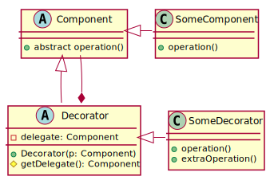
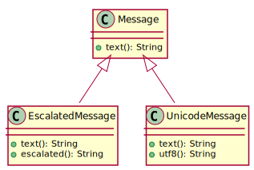
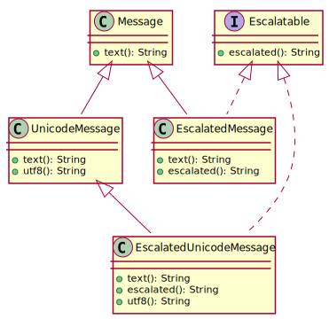

class: title-slide  

# Modul- Fortgeschrittene Programmierkonzepte
### Bachelor Informatik

## 04- Generics
### Prof. Dr. Marcel Tilly
Fakultät für Informatik, Cloud Computing


---

# Mixins, part one.

- **MixIn programming** is a style of software development where units of functionality are created in a class and then mixed in with other classes (see **Aspect Oriented Programming**).

- A mixin class is a parent class that is inherited from - but not as a means of specialization. Typically, the mixin will export services to a child class, but no semantics will be implied about the child "being a kind of" the parent.

- MixIn can provide other services based on the services the original class provides.


.footnote[taken from http://wiki.c2.com/?MixIn]

---

# Review: Decorator Pattern

**Decorator** is a structural design pattern that lets you attach new behaviors to objects by placing these objects inside special wrapper objects that contain the behaviors.

Wearing clothes is an example of using decorators:
- When you’re cold, you wrap yourself in a sweater. 
- If you’re still cold with a sweater, you can wear a jacket on top. 
- If it’s raining, you can put on a raincoat. 
- All of these garments “extend” your basic behavior but aren’t part of you, and you can easily take off any piece of clothing whenever you don’t need it.


---
class: split-50

# Decorator Pattern

Extend (*decorate*) functionality of classes while maintaining primary signature.

```java
FileInputStream fis = new FileInputStream("/objects.gz");
BufferedInputStream bis = new BufferedInputStream(fis);
GzipInputStream gis = new GzipInputStream(bis);
ObjectInputStream ois = new ObjectInputStream(gis);
SomeObject someObject = (SomeObject) ois.readObject();
```

.column[

]

.column[
- Shared base class or interface
- Delegate calls
- Add/overload methods as needed
- Great for cascaded processing
]

---

# Applicability

- Use the Decorator pattern when you need to be able to assign extra behaviors to objects at runtime without breaking the code that uses these objects.

- The Decorator lets you structure your business logic into layers, create a decorator for each layer and compose objects with various combinations of this logic at runtime. The client code can treat all these objects in the same way, since they all follow a common interface.

Use the pattern when it’s awkward or not possible to extend an object’s behavior using inheritance.

- Many programming languages have the *final* keyword that can be used to prevent further extension of a class. For a final class, the only way to reuse the existing behavior would be to wrap the class with your own wrapper, using the **Decorator pattern**.

---

# Review: Inheritance and Interfaces

Example:

- Send text messages (`Message`)
- `EscalatedMessage` by using all-caps (_scream_).
- `UnicodeMessage` for fancy smileys 😎

.center[]

#### How about _escalatable_ _unicode_ messages?


---

# Review: Inheritance and Interfaces

To maintain the type hierary, add an interface `Escalatable` to allow for `is-a Escalatable`.

.center[]

#### Drawback: Code duplication!

---

# Mixins

In OOP, _mixins_ are constructs that

- can be included with other classes without being a base class
- only make sense in combination with the target class


#### Objective

- **Single** implementation for all classes
- `has-a`/`can-do` instead of `is-a`

#### Related Topics

- _Aspect Oriented Programming (AOP)_
- _Dependency Inversion_

---

# Mixins in Java

Use `default` methods in *Interfaces*!

```java
public `interface` Escalated {
    String getText();
    `default` String escalated() {
        return getText.ToUpper();
    }
}
public class Message `implements Escalated` {
    private String m;
    public Message(String m) { this.m = m; }

    public String getText() {
        return m;
    }
}
```


```java
Message m = new Message("Hello World");
System.out.println(`m.escalated()`);       // "HELLO, WORLD"
```


---

# Generics, part one.

- Generic classes and interfaces
- Type erasure, raw type and instantiation
- Generic methods

---

# Generic Classs/Interfaces

The example data structure for this class will be a _map_.
Unlike a _list_ which stores data in a (fixed) sequential order, a _map_ is an associative container that stores a certain _value_ for a certain (unique) _key_.

Compare the basic interfaces:


```java
interface List {
    void add(Object o);  // appends to the list
    Object get(int i);   // retrieves the i-th element
}
```
```java
interface Map {
    void put(Object key, Object value);  // stores object for key
    Object get(Object key);              // retrieves object for key
}

```

---

# Map

There are many ways to implement a map, and they differ greatly in complexity.
Here, let's consider a very basic implementation that consists of map entries (key and value) that are stored as a list.

Remember, [_inner classes_](/02ln-classes-interfaces/) are an excellent means to keep the class hierarchy neat and organized:

```java
class SimpleMapImpl implements Map {
	private class Entry {
		Entry(Object key, Object value) {
			this.key = key;
			this.value = value;
		}
		Object key;
		Object value;
		Entry next;
	}
	// ...
}
```

---

# Map-*put*

- Use a `head` element and the `Entry.next` reference to build up the list.

```java
class SimpleMapImpl implements Map {
	// ...
	private Entry head;  
	@Override
	public void put(Object key, Object value) {
		if (head == null) {
			head = new Entry(key, value);  // easy: first Entry in
			return;
		}
		Entry it = head, prev = null;
		while (it!= null) {
			if (it.key.equals(key)) {  // key exists, update value
				it.value = value;
				return;
			}
			prev = it;
			it = it.next;
		}
		prev.next = new Entry(key, value);  // append at the end
	}
```

---

# Map-*get*

Simiarly, when `get`-ting an element, iterate from the `head` to the end, and return that `value` where the `key` matches, or `null`.

```java
class SimpleMapImpl implements Map {
	// ...
	@Override
	public Object get(Object key) {
		Entry it = head;
		while (it != null) {
			if (it.key.equals(key))  // found it!
				return it.value;
			it = it.next;
		}

		return null;  // no value for this key
	}
}
```

---

# Good or bad design?


Clearly, this implementation is among the worst choices when it comes to performance:

- Can you specify the complexity for `put` and `get` in Landau (\\(O\\))notation?

- How would you improve this implementation to achieve better performance?


---

# Usage

Here's how you would use it:

```java
class App {
	public static void main(String... args) {
		Map map = new SimpleMapImpl();

		// the type conversion to Object is automatic
		map.put("Grummel Griesgram", 143212);
		map.put("Regina Regenbogen", 412341);

		// since the return type is Object, 
        // explicit type conversion is required
		Integer grummel = (Integer) map.get("Grummel Griesgram");    
        // > 143212
		Integer schleichmichl = (Integer) map.get("Schleichmichl");  
        // > null
	}
}
```

---

# What can happen?

Prior to Java 1.5: via `Object` and explicit type casts.


```java
Map map = new SimpleMapImpl();
map.put("Hans", 123);
map.put("Peter", "Pan");

Integer i1 = (Integer) map.get("Hans");   // forced type cast
Integer i2 = (Integer) map.get("Peter");  // ClassCastException!
```

- Implementation is not type safe!
- Problems can occur during *runtime*!

**How can we solve this?**

---

# Runtime vs. Compile Time

If you run it, you will get a _runtime_ error:

```
Exception in thread "main" java.lang.ClassCastException: java.lang.String cannot be cast to java.lang.Integer
	at SimpleStringIntMap.get(SimpleStringIntMapImpl.java:14)
	at App.main(App.java:24)
```

> Note: Even worse, if you were to use a `key` different from `String`, the `get` call would bind to the super class' `get(Object)` method.
> Use the `@Override` annotation to have the compiler warn you of unintentional overloading instead of overwriting.

---

# Generic Classes/Interfaces

```java
class SimpleStringIntMapImpl extends SimpleMapImpl {
    public Integer get(String key) {
        Object val = super.get(key);
        if (val == null)
            return null;
        else
            return (Integer) val;
    }
}
```

**Is this a *good* or a *bad* solution?**

---

# Generic Classes (Interfaces) to the Rescue

> Note: The following works equally for classes and interfaces.

On top of the runtime issues, one would have to `extend` for each key-value type combination to be used, i.e. the `Map` should be literally generic.
Clearly, this is an all but ideal situation which can be fixed using Java _generics_ (introduced in Java 1.5).

---

# Generics

Instead of using `Object` along with type casts, use type parameters (type variables) as placeholder for actual types, i.e. instead of `Object`, use `T`.
The type parameters need to be declared in the signature of the class, in `<...>` and between the name and the opening curly parenthesis:

```java
interface Map<K, V> {
	void put(K key, V value);
	V get(K key);
}
```

While you could use any identifier for the type parameters, it is customary to use single letters.
Use `T` for a single type, `K` and `V` for key and value, `R` and `S` for unrelated types (see towards the end of this class).
If you need to use multiple type parameters, separate them with comma.


---

# 1. Examples

When implementing or extending a generic interface or class, you may either set actual types for the parameters ...

```java
// (1) define actual types: all type parameters bound
class SimpleStringIntMapImpl implements Map<String, Integer> {
	public void put(String key, Integer value) {
		// ...
	}
	// ...
}
```

---

# 2. Example 

... carry over the parameter list ...

```java
// (2) carry over type list: still two type parameters
class SimpleMapImpl<K, V> implements Map<K, V> {
	public void put(K key, V value) {
		// ...
	}
	// ...
}
```

---

# 3. Example

... , or a mix of the two.

```java
// (3) partially carry over; here: one type parameter remains
class SimpleStringMapImpl<V> implements Map<String, V> {
	public void put(String key, V value) {
		// ...
	}
	// ...
}
```
---

# Map- Generics

```java
public class SimpleMapImpl<K, V> implements Map<K, V> {
	class Entry {
		public Entry(K key, V value) {
			this.key = key;
			this.value = value;
		}
		K key;
		V value;
		Entry next;
	}

	Entry head;
	@Override
	public void put(K key, V value) {
		// ...
	}
	@Override
	public V get(K key) {
		// ...
	}
}
```

---

# Usage

```java
class App {
	public static void main(String[] args) {
        // note: type inferred!
		Map<String, Integer> map = new SimpleMapImpl<>();  
		map.put("Hans", 14235);
		Integer i = map.get("Hans");  // > 14235
		
		map.put("Peter", "Willi");  // compile time error!
	}
}
```

As you can see, `SimpleMapImpl` now features _type safety_: instead of failing at runtime with a `ClassCastException`, it now fails at compile time with a type error.

---

# Generics and Static

Note that the inner class was declared non-static:

```java
public class SimpleMapImpl<K, V> implements Map<K, V> {
	class Entry {
		public Entry(K key, V value) { /* ... */ }
		Entry next;
		// ...
	}
	// ...
}
```

---

# Generics and Static

Accordingly, we can use anything of the enclosing instance, including the type arguments (since it can only exist with the outer instance).
If you were to use a static inner class, you need to make it generic as well:

```java
public class SimpleMapImpl<K, V> implements Map<K, V> {
	static class Entry<K, V> {
		public Entry(K key, V value) { /* ... */ }
		Entry<K, V> next;
		// ...
	}
	// ...
}
```

> Note: Here, the static inner class uses the same names `<K, V>`; this is arbitrary, they could also be named `<Y, Z>`.
> Since the class is static, `K` and `V` of the outer class are not visible.

---

# Type Erasure and Raw Type

Internally, the Java compiler actually removes the generic parameters after compilation.
If you look at the compiled classes, you will find

```
. 
- Map.class 
- SimpleMapImpl$Entry.class 
- SimpleMapImpl.class 
```

The type validation is completely done at **compile time** by replacing the type parameters with `Object`.

On completion, there is no need to retain the generic parameters, and only the "basic" .class file is stored.
This has three side effects.
- You can't distinguish between types based their type parameters.
- There is no (direct) way to instantiate an _array_ of generic elements.
- You can instantiate the so-called _raw type_ of a generic class.

---

# What works and what not!

```java
class Example<T> {
	private T inst = new T();           // compiler error!
	private T[] wontWork = new T [10];  // compiler error!

	public static void main(String... args) {
		Example e0 = new Example();  // raw type; effectively T := Object
		Example<String> e1 = new Example<>();   // T := String
		Example<Integer> e2 = new Example<>();  // T := Integer
		
		System.out.println(e0.getClass() == e1.getClass());  // > true!
		System.out.println(e1.getClass() == e2.getClass());  // > true!
	}
}
```

If you must instantiate from a generic type, you need to pass in the type parameter information ("the class") at runtime, and the type must have a default constructor.

---

# Under the hood ...

This is done using Java's reflection mechanism (which will be covered in detail in two weeks).
The runtime type information is stored in the `.class` attribute of a class or interface; it is of type `Class<T>` where the `T` is bound to the type itself.
We can exploit that to generate instances of generic types at runtime:

```java
class Example<T> {
	private T inst;     // definition ok-- no `new` yet!
	private T[] array;

	Example(Class<T> clazz) 
			throws IllegalAccessException, InstantiationException {
		inst = clazz.newInstance();  // uses default constructor
		array = (T[]) Array.newInstance(clazz, 5);  // size of 5
	}

	public static void main(String... args) {
        // pass in actual type!
		Example<String> e = new Example<>(String.class);  
	}
}

```

---

# Generic Methods

Similar to classes and interfaces, type parameters can be attached to methods to make them generic:


```java
class Example {
	static Object[] reverse(Object[] arr) {
		Object[] clone = arr.clone();
		for (int i = 0; i < arr.length/2; i++)
			swap(clone, i, arr.length - 1 - i);
		return clone;
	}
	private static void swap(Object[] arr, int i, int j) {
		Object h = arr[i];
		arr[i] = arr[j];
		arr[j] = h;
	}
	public static void main(String... args) {
		Integer[] arr = {1, 2, 3, 4, 5};
		Integer[] rev = (Integer[]) reverse(arr);  // explicit type cast
		// will produce `ClassCastExecption` at runtime!
		Integer[] oha = (Integer[]) reverse(
            new String[] {"Hans", "Dampf"});
	}
}
```

---

# Generic Methods

For methods, the type parameters are specified prior to the return type, and type parameters can be used both for arguments and return types.

```java
class Example {
	static <T> T[] reverse(T[] in) {
		T[] clone = in.clone();
		for (int i = 0; i < in.length/2; i++)
			swap(clone, i, in.length - 1 - i);
		return clone;
	}
	private static <T> void swap(T[] arr, int i, int j) {
		T h = arr[i];
		arr[i] = arr[j];
		arr[j] = h;
	}
	public static void main(String... args) {
		Integer[] arr = {1, 2, 3, 4, 5};
		Integer[] rev = reverse(arr);  // type safety at compile time!
		// will produce error at compile time! (Integer[] and String[] incompatible)
		Integer[] oha = (Integer[]) reverse(
            new String[] {"Hans", "Dampf"});
	}
}
```

---

# Summary

Lessons today...

- Mixins
- Map- Implementation
- Generics
 - Compile time vs. Runtime
 - Classes
 - Methods

---


# Final Thought!

.center[]

---