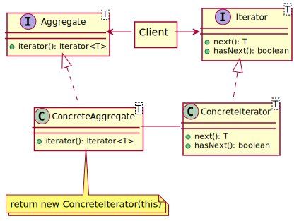
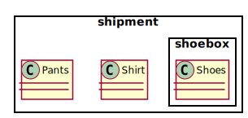
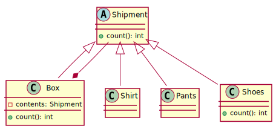

# Design Patterns, pt. 1

This class is the first of a series of three where we will look at patterns that emerged for solving frequent architectural problems.
They work as a shared vocabulary for developers, as a common ground for talking about architecture.
With short names for every-day situations, there is less talking and more doing.

These _design patterns_ are based on principles of object-oriented programming.
They make heavy use of interfaces and inheritance, composition, and delegation and encapsulation.
There are 23 established patterns in different categories: creational, structural and behavioral.
Together, they form a toolset for clear software architecture.

In the following weeks, we will discuss some of the more frequently used patterns, how they are designed and how to implement them.
The book [Design Patterns](https://www.amazon.de/Patterns-Elements-Reusable-Object-Oriented-Software/dp/0201633612/) by Erich Gamma _et al._ is the de-facto reference, if you're interested in an exhaustive overview.

> All well-structured object-oriented architectures are full of patterns.
> Indeed, one of the ways I measure the quality of an object-oriented system is to judge whether or not its developers have paid careful attention to the common collaborations among its objects.
> Focusing on such mechanisms during a system's development can yield an architecture that is smaller, simpler and far more understandable than if these patterns are ignored.

Grady Booch, Foreword to Design Patterns, 1994(!)


# Unified Modeling Language (UML)

## Class Diagrams

Since we will be talking a lot about software architecture in the next three weeks, let's talk about _class diagrams_.
The following diagram shows the six most frequent types of relations for UML class diagrams.


An _association_, directed or undirected, is the most generic relation between classes; typically the arrow will be labeled for clarity.

_Inheritance_ and _Realization/Implementation_ are used when a class or interfaces inherits from an interface or class, or a class realizes or implements an abstract class or interface.

_Dependency_ between classes is typically realized via loose coupling, i.e. the dependent class will be provided a reference at some point.

_Aggregation_ and _Composition_ describe the relation where one object is made from others.
The hollow diamond (aggregation) means that the whole can (conceptually) exist without the part, e.g. a pond can contain fish or ducks, but can also exist without.
The solid diamond (composition) means that the whole can only exist with all the parts, e.g. a car is only a car if it has an engine.
The diamond sits at that end of the arrow that connects to the class modeling the whole.

The diagrams for these lecture notes are made using [PlantUML](http://plantuml.com/) ([reference](http://plantuml.com/class-diagram)).


## Sequence Diagrams

In contrast to class diagrams, _sequence diagrams_ (sometimes: interaction diagrams) describe how _objects_ interact with each other.
They are read top to bottom, and following the arrows


> Note: The UML diagrams listed in these lecture notes are based on Gamma _et al._'s diagrams, often with small modifications for clarity.


So without further ado, let's dive right in.


# Iterator

Recall how we iterate over an array: you can either use a traditional [_for_ loop](https://docs.oracle.com/javase/tutorial/java/nutsandbolts/for.html) (over the indices), or you can use a [_for-each_ statement](https://docs.oracle.com/javase/8/docs/technotes/guides/language/foreach.html).

```java
int[] array = new int[] {3, 1, 3, 3, 7};

for (int i = 0; i < array.length; i++)
	System.out.println(array[i]);

for (int v : array)
	System.out.println(v);
```

The main difference is that in the first variant you can alter the content of the array, whereas the second is read-only (since the current index is unknown).

Transfer this to our favorite example data structure, a basic list.

```java
interface BasicList<T> {
	T get(int i);
	void add(T value);
	int size();
}
```

And a simple implementation:

```java
class SimpleList<T> implements BasicList<T> {
	private class Element {
		Element(T value) { this.value = value; }
		Element next;
		T value;
	}

	private Element root;
	private int size;

	public void add(T value) {
		if (root == null) {
			root = new Element(value);
			size = 1;
			return;
		}

		Element it = root;
		while (it.next != null)
			it = it.next;

		it.next = new Element(value);
		size++;
	}

	public T get(int i) {
		if (root == null)
			throw new NoSuchElementException();

		Element it = root;
		while (i-- > 0) {
			it = it.next;

			if (it == null)
				throw new NoSuchElementException();
		}

		return it.value;
	}

	public int size() {
		return size;
	}
}
```

Similar to arrays, we can now iterate over a list:

```java
BasicList<Integer> list = ...;
for (int i = 0; i < list.size(); i++) {
	System.out.println(list.get(i));
}
```

This is however terribly inefficient, since for each `get()` call, we need find the position from the beginning.

Iteration over the elements is such a frequent use case, so isn't there a better way?


## Digression: Adding Muliple Values
Let's take a short digression.
Sometimes you want to add more than one value at the same time:

```java
public void addAll(T[] values) {
	for (T v : values)
		add(v);
}
```

A major drawback of this method is that the repeated call to `add()` is highly inefficient: to add a new element, you must always go from the root to the end, before linking the new element.
This results in a constructor complexity of \\(O(n^2)\\).

Clearly, if we have a number of Elements to be added, we can remember where the last element was, reducing the complexity to \\(O(n)\\).

```java
public void addAll(T[] values) {
	// start at the beginning, find the end
	Element it = root;
	while (it != null && it.next == null)
		it = it.next;
	
	// for each new value, remember where we added it
	for (T v : values) {
		if (it == null) {
			root = it = new Element(v);
		} else {
			it.next = new Element(v);
			it = it.next;
		}
	}
	size = size + values.length;
}
```

Thus, using internal knowledge on how the data structure is shaped, we could insert much more efficiently.


## Iterator and Iterable

Let's come back to our efficiency problem, with repeated calls to `get()` leading to an \\(O(n^2)\\) complexity.

```java
SimpleList<Integer> list = SimpleList<>();
list.addAll(new int[] {3, 1, 3, 3, 7});
for (int i = 0; i < list.size(); i++) {
	System.out.println(list.get(i));
}
```

To improve this, we need to think a bit out of the box (and a bit more abstract).
Conceptually, iterating over a data structure can very well be described as a _while_ loop:

```java
int i = 0;  // start at the beginning
while (i < list.size()) // while we're not at the end
	System.out.println(list.get(i++));  // get the next element and advance
```

And in fact, these are the basic operations of the [_iterator_](https://docs.oracle.com/javase/8/docs/api/java/util/Iterator.html) `java.util.Iterator<T>`

```java
interface Iterator<T> {
	boolean hasNext();  // is there one more element?
	T next();           // give me that, and advance!
}
```

Thus we can write the iteration as

```java
Iterator<Integer> it = list.???;  // what about this?
while (it.hasNext())
	System.out.println(it.next());
```

So where do we get the iterator from?
It must come from the list class itself, since it is the only one allowed to access it's `private` parts.

Recall how we iterated over the list, when getting an element.

```java
// abbreviated...
Element it = root;
while (i-- > 0)
	it = it.next;
return it.value;
```

The iterator uses the same idea: store the current position in an attribute (`it`), and advance when necessary (`it = it.next`).

```java
public Iterator<T> iterator() {
	// make a new anonymous inner class
	return new Iterator<T>() {
		Element it = root;  // we start at the root
		
		@Override
		public boolean hasNext() {
			// do we point to a valid element?
			return it != null;
		}

		@Override
		public T next() {
			// remember current value, advance and return
			T value = it.value;
			it = it.next;
			return value;
		}
	};
}
```

Since the `iterator()` function signature should be the same for all collections that allow itertion, it is abstracted in the [interface `java.lang.Iterable<T>`](https://docs.oracle.com/javase/8/docs/api/java/lang/Iterable.html).

```java
interface Iterable<T> {
	Iterator<T> iterator();
}
```

Note that it is in the language specification package `java.lang`, since it enables the use of `Iterable`s in _for-each_ statements (which is a language feature).

```java
class SimpleList<T> implements BasicList<T>, Iterable<T> {
	// ...
	public Iterator<T> iterator() { /* ... */ }
}
```
```java
SimpleList<Integer> list = new SimpleList<>();
list.addAll(3, 1, 3, 3, 7);
for (Integer i : list) {
	System.out.println(i);
}
```


### UML Diagram



Typically, the `ConcreteIterator<T>` is implemented as an inner, local or anonymous class within the `ConcreteAggregate<T>`, since intimate knowledge (and access!) of the data structure is required.

The iterator is a _behavioral_ pattern.


# Composite

For the composite, consider a rather practical example.
Let's say, you shop for fashion online and order a shirt, pants and a pair of shoes.
Most likely, you will get shipped one package, that contains the shirt, pants and another box, that contains the shoes.



So obviously, a box can contain a box can contain a box, etc.
If we wanted to count of all the _individual items_ (rather than the boxes), we would need to unbox if we hit a box.

So a naive implementation could be:

```java
class Shirt {}
```
```java
class Pants {}
```
```java
class Shoes {}
```
```java
class Box {
	Object[] objects;

	int count() {
		int c = 0;
		for (Object o : objects) {
			if (o instanceof Box)
				c += ((Box) o).count();
			else if (o instanceof Shoes)
				c += 2;
			else
				c += 1;
		}
		return c;
	}
}
```

This is a bit unfortunate: any time we add a new class of items (e.g. `Jacket`), we actually need to modify the `Box.count()` method.

Composite to the rescue: with a clever combination of inheritance and composition, we can maintain the expressiveness of a diverse class hierarchy while keeping logic to where it belongs.



```java
abstract class Shipment {
	int count() {
		return 1;
	}
}
```
```java
class Shirt extends Shipment { /* nothing special */ }
class Pants extends Shipment { /* nothing special */ }
class Shoes extends Shipment {
	int count() { return 2; }
}
```
```java
class Box extends Shipment {
	private Shipment[] contents;
	int count() {
		int c = 0;
		for (Shipment s : contents)
			c += s.count();
		return c;
	}
}
```

This architecture separates the data _structure_ (the potential nesting of objects) from the _logic_ (how many items per piece).

The composite is characterized by an inheriting class that overwrites a (often abstract) method, while being composed of instances of the base class.

## UML Diagram


The composite is a _structural_ pattern.

## Examples

- file systems:
	+ component: entry
	+ composite: directory
	+ leaf: actual file
- n-ary tree structures: a (general) node is the component, internal nodes are the composite, and a leaf is a leaf.
- JUnit:
	+ component: _test_
	+ composite: _test suite_ comprised of multiple tests
	+ leaf: individual test case
- HTML documents:
	+ component: _element_
	+ composite: containers (`div`, `p`, etc.)
	+ leaf: _text nodes_
- GUI libraries (such as Android)
	+ component: `android.view.View`
	+ composite: `android.view.ViewGroup`
	+ leaf: individual widgets, e.g. `Button`


# Observer

The classic example for the observer pattern used to be newspapers.
But it seems the new classic is to "follow" somebody's updates on social networks, or join a messenger broadcast group (formerly: mailing lists, listserve).

Let's consider the latter: you join (_subscribe to_) a messenger broadcast group.
From then on, you receive (_observe_) all messages, until you leave (_unsubscribe from_) the group.

Here is an example sequence diagram; whoever provides the data is _observable_, the interested subscribers are the _observers_.


As you can see, there is some basic logic to be implemented for managing and notifying the subscribers.
The Java library provides us with the [abstract class `java.util.Observable`](https://docs.oracle.com/javase/8/docs/api/java/util/Observable.html) and the [interface `java.util.Observer`](https://docs.oracle.com/javase/8/docs/api/java/util/Observer.html).
The following class diagram illustrates their relation:


The observer is a _behavioral_ pattern, and sometimes referred to as publish/subscribe.
It is most used to react to events that are not in control of the program (user interactions, networking errors, etc.)


## Examples and Variants

- Excel: The Graph subscribes to the cells, updates on change.
- some variants use `update()` without reference or info data
- GUI: user interactions such as `OnClickListener`, `OnSelectionChanged`, etc.
- I/O: device (disk) or connection (network) changes
- interrupts: power, usb, etc.
- databases: inserts, updates, deletes


# Digression: Android and MVC

> Neither MVC, JavaFX or Android are essential to this class.
> However, JavaFX or Android are excellent means to demonstrate design patterns "in the wild," so we use them in the assignments to make them more meaningful and hands-on.

<p style="text-align: right">&#8718;</p>