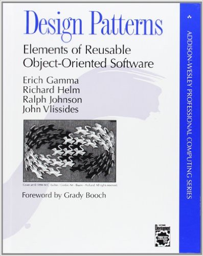

class: title-slide  

# Modul - Fortgeschrittene Programmierkonzepte
### Bachelor Informatik

## 07 - Design Pattern, pt. 1
### Prof. Dr. Marcel Tilly
Fakultät für Informatik, Cloud Computing

---

# Recap

- Reflection 
- JSON
- REST APIs and how to call things

.center[]
---

# What is JSON

- JSON stands for _JavaScript Object Notation_.
- You can find the _spec_ here: [JSON](http://json.org)
- JSON is a lightweight format for storing and transporting data
- JSON is often used when data is sent from a server to a web page
- JSON is "self-describing" and easy to understand
	- No strong schema validation, see XML and XMLSchema
	- but there is [JSON Schema](https://json-schema.org)

```json
{
	"employees":[
		{"firstName":"John", "lastName":"Doe"},
		{"firstName":"Anna", "lastName":"Smith"},
		{"firstName":"Peter", "lastName":"Jones"}
	]
}
```

---

# How to Convert an Object into JSON?

- _JSON is nice for storing and transporting_:
**JSON is used to serialization and deserialization**

```java
public class Person {

    private String firstName;
    private String lastName;
    private int age;

    public Person(String firstName, String lastName, int age) {
        this.firstName = firstName;
        this.lastName = lastName;
        this.age = age;
    }
}
```

**How to serialize an object of this class to JSON?**

---

# Use Reflection

Idea: We can use the _reflection API_ to introspect and access data!

```java
    public static String toJson(Object obj) {
		StringBuffer sb = new StringBuffer("{");
		
        Class cl = obj.getClass();
        for (Field f: cl.getDeclaredFields()) {
            f.setAccessible(true);
		
			sb.append("\"" + f.getName() + "\" : ");
			if (f.getType().equals(int.class)) 
				sb.append(f.get(obj));
			else 
				sb.append("\"" + f.get(obj) + "\",");
		}
		
        sb.append("}");
		
		return sb.toString();
    }
```

---

# Would this work?

Actually, this works great!

```java
	public static void main(String[] args) throws Exception {
		Person p = new Person("Max", "Mustermann", 33);
		System.out.println(toJson(p));
		//{"firstName" : "Max","lastName" : "Mustermann","age" : 3}
    }
```

What about `fromJson()` and other data types, e.g. Date, float, arrays ...

---

# This is cumbersome...

... do not reinvent the wheel!

Let's use a framework: [GSON](https://github.com/google/gson)

```java
    public static void main(String[] args) throws Exception {
        Person p = new Person("Max", "Mustermann", 33);
        String s = toJson(p);
        System.out.println(s);
        //{"firstName" : "Max","lastName" : "Mustermann","age" : 3}
		
		Gson gson = new Gson();
        Person p2 = gson.fromJson(s, Person.class);
		System.out.println(p.equals(p2));
		// true
    }
```

---

# A Word about REST

#### REST = **RE**presentational **S**tate **T**ransfer

- REST, or **RE**presentational **S**tate **T**ransfer, is an architectural style for providing standards between computer systems on the web.
- making it easier for systems to communicate with each other. 
- REST-compliant systems, often called RESTful systems, are characterized by how they are stateless and separate the concerns of client and server.

.center[]

---

# Statelessness

- Systems that follow the REST paradigm are _stateless_
	- meaning that the server does not need to know anything about what state the client is in and vice versa.

- In this way, both the server and the client can understand any message received, **even without seeing previous messages**.

- This constraint of statelessness is enforced through the use of _resources_, rather than _commands_.

- _Resources_ describe any object, document, or thing that you may need to store or send to other services.

- Because REST systems interact through standard operations (**CRUD**) on resources, they do not rely on the implementation of interfaces.

---

# Making Requests

REST requires that a client make a request to the server in order to retrieve or modify data on the server. 
A request generally consists of:

- an **HTTP verb** (Standard Operation), which defines what kind of operation to perform
- a **header**, which allows the client to pass along information about the request
- a path to a resource (URL)
- an optional message body containing data

```shell
curl -X GET http://heise.de
```

```shell
wget http://heise.de
```

```shell
curl -d '{"key1":"value1", "key2":"value2"}' 
     -H "Content-Type: application/json" 
	 -X POST http://localhost:3000/data
```

---

# HTTP Verbs

There are 4 basic HTTP verbs we use in requests to interact with resources in a REST system:

- **GET** — retrieve a specific resource (by id) or a collection of resources
- **POST** — create a new resource
- **PUT** — update a specific resource (by id)
- **DELETE** — remove a specific resource by id

Get a random Chuck Norris Joke:

```shell
curl -X GET https://api.icndb.com/jokes/random
```

```json
{ "type": "success", 
  "value": { 
	  "id": 273, "joke": "Chuck Norris does not kick ass and take
	  names. In fact, Chuck Norris kicks ass and assigns the corpse
	  a number. It is currently recorded to be in the billions.", 
  "categories": [] } 
```

---

# A WebRequest in Java

How would we implement a HTTPRequest in Java?

- Use `URL`-class to represnet the Url
- Use `HttpURLConnection`-class to connect to the server
- `BufferedReader`and `InputStream` to read the request

---

# HTTPRequest in Java

Get a joke from ICNDB:

```java
public static void main(String[] args) throws Exception {
	URL url = new URL("https://api.icndb.com/jokes/random");
	HttpURLConnection con = (HttpURLConnection) url.openConnection();
	con.setRequestMethod("GET");
	con.connect();
	BufferedReader in = new BufferedReader(
			new InputStreamReader(con.getInputStream()));
	String inputLine;
	StringBuffer content = new StringBuffer();
	while ((inputLine = in.readLine()) != null) {
		content.append(inputLine);
	}
	// close resources here!
}	
```
**Can you make it a base class and design your own typed version?**
---

# Because it is cumbersome...

... we can use a framework.

[Retrofit](https://github.com/square/retrofit): consume REST interfaces without any pain

```java
public interface ICNDBApi {
  @GET("jokes/random")
  Call<Sring>> getRandomJoke();
}
```
```java
Retrofit retrofit = new Retrofit.Builder()
		.baseUrl("https://api.icndb.com/")
		.addConverterFactory(ScalarsConverterFactory.create())
		.build();
ICNDBApi2 service = retrofit.create(ICNDBApi2.class);
Call<String> repos = service.getRandomJoke();
String s = repos.execute().body();
```

---

# Design Patterns

Patterns that emerged for solving frequent problems

Shared vocabulary for developers
- common ground for talking about architecture
- less talking, more doing

_Design Patterns_ are based on principles of object-oriented programming.
- interfaces, inheritance
- composition, delegation and encapsulation

**There are 23 established patterns in different categories: creational, structural and behavioral.**

Toolset for a clear software architecture.

---

# Recommended Reading



## [Design Patterns](https://www.amazon.de/Patterns-Elements-Reusable-Object-Oriented-Software/dp/0201633612/)
by Gamma/Helm/Johnson/Vlissides (_Gang of Four_).


---

# Class Diagrams

.center[]

**Association**: References a ...

**Inheritance**: _Is-A_ relation

**Implements**: behavioral relation

**Composition**: real-world whole-part relation

**Aggregation**: "catalog" containment, can exist independently

---

# Sequence Diagrams

.center[]

In contrast to class diagrams, _sequence diagrams_ (sometimes: interaction diagrams) describe how _objects_ interact with each other.
They are read top to bottom, and following the arrows

---

# Iterator-Pattern

Let's assume, you want to provide a way to iterator over your own data structure wihtout exposing the internals (_information hiding_):

```java
SimpleList<Integer> list = SimpleList<>(3, 1, 3, 3, 7);
```

```java
int i = 0;
for ( ; i < list.size(); ) {
	System.out.println(list.get(i));
	i++;
}
```


```java
Iterator<Integer> it = list.???;

while (it.hasNext()) {
	Integer v = it.next();
}
```

**How does an iterator look like?**

---

# Iterator-Pattern

```java
class SimpleList<T> implements BasicList<T> {
	// ...
	public Iterator<T> iterator() {
		return new Iterator<T>() {
			Element it = root;
			@Override
			public boolean hasNext() {
				return it == null;
			}

			@Override
			public T next() {
				T value = it.value;
				it = it.next;
				return value;
			}
		};
	}
}
```

---

# UML: Iterator-Pattern

The iterator is a _behavioral_ pattern.

Typically, the `ConcreteIterator<T>` is implemented as an inner, local or anonymous class within the `ConcreteAggregate<T>`, since intimate knowledge (and access!) of the data structure is required.

.center[]


---

# Composite-Pattern

Let's say, you shop for fashion online and order a shirt, pants and a pair of shoes.
Most likely, you will get shipped one package, that contains the shirt, pants and another box, that contains the shoes.

.center[]

So obviously, a box can contain a box can contain a box, etc.
If we wanted to count of all the _individual items_ (rather than the boxes), we would need to unbox if we hit a box.
---

# UML: Composite-Pattern

The composite is a _structural_ pattern.

This architecture separates the data _structure_ (the potential nesting of objects) from the _logic_ (how many items per piece).

The composite is characterized by an inheriting class that overwrites a (often abstract) method, while being composed of instances of the base class.

.center[]

---

# Composite Examples

- file systems: identifier, directory, file, link
- JUnit:
	+ component: _test_
	+ composite: _test suite_ comprised of multiple tests
	+ leaf: individual test case
- HTML documents:
	+ component: _element_
	+ composite: containers (`div`, `p`, etc.)
	+ leaf: _text nodes_
- GUI libraries (such as Android)
	+ component: `android.view.View`
	+ composite: `android.view.ViewGroup`
	+ leaf: individual widgets, e.g. `Button`

---

# Observer-Pattern

The classic example for the observer pattern used to be newspapers.
But it seems the new classic is to "follow" somebody's updates on social networks, or join a messenger broadcast group (formerly: mailing lists, listserve).

Let's consider the latter: you join (_subscribe to_) a messenger broadcast group.
From then on, you receive (_observe_) all messages, until you leave (_unsubscribe from_) the group.

.center[]

---

# Observer-Pattern

As you can see, there is some basic logic to be implemented for managing and notifying the subscribers.
The Java library provides us with the [abstract class `java.util.Observable`](https://docs.oracle.com/javase/8/docs/api/java/util/Observable.html) and the [interface `java.util.Observer`](https://docs.oracle.com/javase/8/docs/api/java/util/Observer.html).
The following class diagram illustrates their relation:

.center[]

The observer is a _behavioral_ pattern, and sometimes referred to as publish/subscribe.
It is most used to react to events that are not in control of the program (user interactions, networking errors, etc.)

---

# Examples and Variants

- Excel: The Graph subscribes to the cells, updates on change.
- some variants use `update()` without reference or info data
- GUI: user interactions such as `OnClickListener`, `OnSelectionChanged`, etc.
- I/O: device (disk) or connection (network) changes
- interrupts: power, usb, etc.
- databases: inserts, updates, deletes


---

class: split-50

# Model-View-Controller Pattern


.column[

]

.column[
**Model**: 
- current data and state of the app
- Java program

**View**: 
- visualization of data and state
- Android widget library

**Controller**: 
- business logic (by you)
- user input (provided by Android OS)
]

_Sometimes you will see Model-View-Viewcontroller (MVVC) or Model-View-Viewmodel (MVVM), adding an intermediate layer._

---

# Model

Data structures, entity types, auxiliary types.

Core algorithms to load, store, organize and transform data.

Typically implemented in (pure) Java.

Examples:
- `Joke` class to store jokes from ICNDB
- networking code to retrieve jokes from ICNDB
- internal cache to store jokes

Strictly speaking, _model_ only refers to data; that's why some talk of MVVM or MVVC


---

# View

What you _see_ on when you open the app.

Text views, buttons, lists, images, etc.

Typically implemented using a certain XML format, which is then "inflated" by a loader program.

```xml
<?xml version="1.0" encoding="UTF-8"?>
<GridPane fx:controller="MainController">
	<columnConstraints>
		<ColumnConstraints hgrow="NEVER" />
		<ColumnConstraints hgrow="ALWAYS" />
	</columnConstraints>
	<Button fx:id="btnRefresh" text="Refresh" 
			GridPane.columnIndex="0" GridPane.rowIndex="0">
	<ListView fx:id="mealsL	ist" 
			GridPane.columnIndex="0" GridPane.columnSpan="3" 
			GridPane.hgrow="ALWAYS" GridPane.rowIndex="1"
			GridPane.vgrow="ALWAYS" />
</GridPane>

```

---

# Controller

Manipulate the model using user or system input.

User input: button clicks, swipe-for-refresh, etc.

System signals: power or network configuration changes, interrupts

Typically implemented in Java, by triggering certain logic on a certain event.

---

# JavaFX: Basic Building Blocks (1)

- see the [base project](https://github.com/hsro-inf-fpk/07-composite-observer-jfx) for this weeks assignment
- Main entry point is the _Application_ 
- Still nice that the Application is still launched via `public static void main(String... args)`

```java
public class App extends Application {

	public static void main(String[] args) {
		launch(args);
	}
	@Override
	public void start(Stage stage) throws Exception {
		Parent root = FXMLLoader.load(getClass().
			getResource("views/main.fxml"));
		stage.setTitle("My App");
		stage.show();
	}
}}
```

---

# Basic Components


- `TextField` and `TextArea`
- `Button`
- `CheckBox` and `RadioButton`
- `ListView`

---

# Referencing Components on the Screen

You can get a handle on the components rendered on the screen.
- set the `fx:id` field in the XML layout
- inside the controller code, use the `@FXML` annotation with that correct `fx:id` name

```java
public class MainController implements Initializable {

	// use annotation to tie to component in XML
	@FXML
	private Button btnRefresh;

	@FXML
	private ListView<String> mealsList;
```

---

# Wiring Components and User Input

Components can react to certain user input, for example
- _click_, using the `setOnAction()`
- _

```java
public class MainController implements Initializable {

...
	public void initialize(URL location, ResourceBundle resources) {
		// set the event handler (callback)
		btnRefresh.setOnAction(new EventHandler<ActionEvent>() {
			@Override
			public void handle(ActionEvent event) {
				// here you can react on the event				
			}
		});
	}
}
```

---

# A Word on Logging

`System.out` etc. normally doesn't work (no terminal, no service!)


Use system logging services (rendered to logcat):

```java
import import java.util.logging.Logger;
// ...
Logger logger = Logger.getLogger(OpenMensaAPITests.class.getName());
logger.info("Hello, world!");
```

Use a _toast_ (Android Apps) instead:

```java
Context context = getApplicationContext();
CharSequence text = "Hello toast!";
int duration = Toast.LENGTH_SHORT;

Toast toast = Toast.makeText(context, text, duration);
toast.show();
```

---

# Some Peculiarities

- unless you actively terminate apps, they won't terminate (until the OS decides to kill them)
- when you launch an app, you actually launch an activity (the app may already be running)
- when cycling activities, they may actually be recreated
- rotation events cause activities to be recreated
- apps (sic!) have separate threads for GUI, services and logic
	+ you can't run IO (networking, files) on the GUI thread
	+ you can run services without an open activity (think Dropbox!)
- getting from one activity to another, you need to [understand the intent mechanism](https://developer.android.com/guide/components/intents-filters.html)

---

# Final Thought!

.center[]

---
