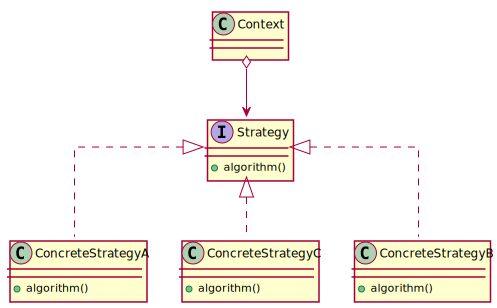

class: title-slide  

# Modul - Fortgeschrittene Programmierkonzepte
### Bachelor Informatik

## 08 - Design Patterns, pt. 2
### Prof. Dr. Marcel Tilly
Fakultät für Informatik, Cloud Computing

---

# Agenda for today

What is on the menu for today?

- Singleton Pattern
- Strategy Pattern 
- Factory Pattern
- Command Pattern

.center[]
---

# Singleton - Pattern

The task is pretty simple:

**How can you ensure that a certain object is unique among your application?**

.center[]

---

# Singleton in Java

In Java, there are a number of ways to realize that.
1. Restrict access to the constructor! Avoid that someone can create instances.
1. The safest thing to do is to make the constructor _private_.
1. If we can only create instances _from within the class_, we can allocate a static attribute at startup.

```java
class Singleton {
	public static final Singleton instance = new Singleton();

	private Singleton() {

	}
}
```
```java
Singleton.instance.doSomething();
```

---

# Singleton in Java

- This works if the constructor is trivial, and no further setup of `instance` is required.
- But what if you need to do some extra work for `instance` to be ready-to-use?
-> The answer is: use a _static initializer block_.

And one more thing: the public visibility does not allow to guard the instance, e.g. from simultaneous access from multiple threads.
To fix this, use a getter method.

---

# Singleton in Java

```java
class Singleton {
	private final static Singleton instance;

	static {
		instance = new Singleton();

		// do more work...
	}

	private Singleton() {

	}

	public static Singleton getInstance() {
		// guard if necessary...
		return instance;
	}
}
```
```java
Singleton.getInstance().doSomething();
```

---

# Singleton in Java

The drawback of this solution is that the singleton is now instantiated at startup, and regardless if it is actually used.
To fix this, use a lazy initializer:

```java
class Singleton {
	private static Singleton instance;  // note: no final!

	public static Singleton getInstance() {
		if (instance == null) {
			instance = new Singleton();

			// do more stuff...
		}

		return instance;
	}

	private Singleton() {

	}
}
```
```java
Singleton.getInstance().doSomething();
```

---

# Singleton

## Structure and Participants

.center[]

- `Singleton`
	+ typically responsible for managing its unique instance
	+ provides operation to obtain unique instance (in Java: `static` method)

---

# Singleton

## Discussion

- Singletons are standard practice to avoid resource conflicts or overallocation.
- However, they are at the same time (strongly) disencouraged if working in a multi-threaded (parallel) environment: 
	- while the actual resource conflict can be (usually) solved with locking, 
	- the process itself may dramatically reduce the benefit of parallel processing.

For advanced developers: Favor [_dependency injection_](https://en.wikipedia.org/wiki/Dependency_injection) over singletons.

---

# Singleton

## Examples

- Logging facilities
- Event busses and dispatch queues
- Device handles (there is only 1 physical device, e.g. `System.out`)
- Service objects (eg. API wrappers, ...)

---

# Strategy - Pattern

.center[]

The _strategy_ pattern helps to abstract a certain method from its actual implementation.
It is so fundamental to Java that it has the syntax keyword `interface` to separate _declarations_ from _implementations_.

**Do you have an example where you have used a _strategy_ pattern already?**

---

# Strategy

## Simple Example (Sorting)

Sort a list in ascending or descending order, using different `Comparator<T>`s.

```java
List<Integer> list = new LinkedList<>();
list.add(4); list.add(7); list.add(1); list.add(1);

Collections.sort(list, new Comparator<Integer>() {
	@Override
	public compare(Integer a, Integer b) {
		return a.compareTo(b);
	}
});

Collections.sort(list, new Comparator<Integer>() {
	@Override
	public compare(Integer a, Integer b) {
		return b.compareTo(a);  // note the flipped order!
	}
});
```
---

# Strategy

## Other Example (Game)

Check out [JavaKara](https://www.swisseduc.ch/informatik/karatojava/javakara/), a little robot bug that can be moved through a tiny world.

.center[]

---

# Strategy with Kara

Here is a small code snippet to get Kara working:

```java
public class Kara extends JavaKaraProgram {
	public static void main(String[] args) throws Exception {
		Kara k = new Kara();
		k.run("src/main/resources/world2.world");
	}

	@Override
	public void myMainProgram() {
		kara.move();        // one step forward
		kara.turnLeft();    // you guessed it...
		kara.turnRight();
		kara.treeFront();   // tree ahead?
		kara.putLeaf();     // take a clover leaf
		kara.removeLeav();  // remove a clover leaf		
	}
}
```

**What is the strategy to place leafs on every field?**

---

# Strategy


**My Strategy** thinking:

To have _kara_ explore the whole room (starting from the center), I could think of two _strategies_:

- walk concentric growing circles until the room is fully explored
- walk to the top-right corner; then sweep left-to-right, top-to-bottom.


The sample code can be found in <https://github.com/hsro-inf-fpk/hsro-inf-fpk.github.io/tree/master/examples/src/main/java/designpattern/strategy>.

Check out the `StrategyExampleBad`, which has two explicit plans,

1. `planA()` and
2. `planB()`.

Contrast it with the implementation in `StrategyExample`: here, the logic of the strategy is moved to a separate class which is instantiated as needed.

---

# Strategy

## Structure and Participants

Mechanism to provide different implementations to achieve the same outcome.

.center[]

---

# Strategy

## Discussion

The strategy pattern is used to represent a similar functionality with different implementations:
For example, the `Stream.filter(Predicate<T> p)`, `Iterable.iterator()` or `Collection.sort(Comparator<T> c)`.

You can easily spot potential refactoring areas if you have code such as

```java
if (isWav())
	return decodeWav(data);
else if (isMP3())
	return decodeMP3(data);
else
	return data.raw;
```

with the `decode{Wav,MP3}()` methods being members of the class.
Refactor to the strategy pattern by extracting them from the class and use them via a common interface.

---

# Strategy

## Examples

- `Comparator` interface, to customize sorting
- Encryption and authentication protocols
- Media encoders (mp3, mp4, aac, etc.)
- Serializers ("save as..." feature)

**Do you have other examples?**

---

# Factory

A factory provides instances that fulfill a certain interface.

.center[]

---

# Factory

## Simple Example

A package with public interfaces but package-private classes.

```java
package mypackage;

public interface Klass {
	void method();
}
```
```java
package mypackage;

class KlassImpl implements Klass {
	public void method() {
		System.out.println("Hello World!");
	}
}
```

---

# Factory

## Simple Example

So from outside the package, you can't instanciate `KlassImpl`:

```java
package someApp;
class MyApp {
	public static void main(String... args) {
		mypackage.Klass k = new mypackage.KlassImpl();  // not visible!
	}
}
```

**This is where you need a factory method, often attached to an abstract class or as a default method to an interface.**

---

# Factory

## Simple Example

```java
package mypackage;

public interface Klass {
	void method();
	default Klass create() {
		return new KlassImpl();  // inside package: visible!
	}
}
```
```java
mypackage.Klass k = mypackage.Klass.create();
```

As you can see, the _user_ of the package relies on the interface, and has no idea on which class was actually instantiated.

---

# Factory

## Another Example

Recall the `Composite` pattern and the strcuture of JSON document and XML:

```json
{
	"key": "value",
	"nested": {
		"key": "value"
	}
}
```

```xml
<element>
	<key>value</key>
	<element>
		<key>value</key>
	</element>
</element>
```

---

# Factory

## Another Example

With Java interfaces this could look like:

```java
interface Component {
	String toString();
}

interface Composite extends Component {
	void add(Component c);
}

interface Leaf extends Component {
}
```

---

# Factory

## Another Example

Without a factory, you would have to manually construct the composite:

```java
JsonComposite root = new JsonComposite("root");
root.add(new JsonLeaf("key", "value"));

Composite nested = new JsonComposite("nested");
nested.add(new JsonLeaf("key", "value"));
root.add(nested);

System.out.println(root);
// "root": {"key": "value", "nested": {"key": "value"}}
```

**And similarly for `XmlComposite`.**

---

# Factory

## Another Example

If you abstract the instance creation into a factory, you could generalize the code significantly (for JSON and XML):

```java
interface CompositeFactory {
	Composite createComposite(String name);
	Leaf createLeaf(String name, String value);
}
class JsonFactory implements CompositeFactory {
	@Override
	public Composite createComposite(String name) {
		return new JsonComposite(name);
	}
	@Override
	public Leaf createLeaf(String name, String value) {
		return new JsonLeaf(name, value);
	}
}
```

---

# Factory

## Another Example

And now, you can use it:

```java
CompositeFactory f = new JsonFactory();
// CompositeFactory f = new XmlFactory();

Composite root = f.createComposite("root");
root.add(f.createLeaf("key", "value"));

Composite nested = f.createComposite("nested");
nested.add(f.createLeaf("key", "value"));

root.add(nested);

System.out.println(root);
```

**In case, you want to get the XML representation, you only need to replace the factory that produces the concrete clases; the construction logic remains the same.**

---

# Factory

## Structure and Participants

Structure to enforce the use of abstract factories and products, by hiding the actual instantiation of the concrete factory and products.

.center[]

---

# Factory

## Structure and Participants

- `AbstractFactory`
	+ declares interface for operations that create the abstract products
- `ConcreteFactory`
	+ _implements_ the operations and procudes concrete products
- `AbstractProduct`
	+ declares interface for operations
- `ConcreteProduct`
	+ _implements_ the operations
- `Client`
	+ uses only interfaces declared by `AbstractFactory` and `AbstractProduct`

---
# Factory

## Discussion

- The factory pattern is omnipresent:
	- sometimes it is realized as a single _factory method_
	- sometimes as a larger factory serving different objects.

The most common use is when developing against interfaces where the implementing classes are package-private.

The package would then expose a _factory_ that allows to generate instances that implement the public interfaces -- with internals hidden from the client.

---

# Factory

## Examples

Typically objects that are either complicated to instantiate or which should not be exposed outside of a package.

- Iterators
- Objects that have complex intantiation protocols
- Logging instances
- API wrappers

---

# Command

Mechanism to organize, execute and undo operations on certain objects.

---

# Command

## Example - Kara

We could write a program that takes input from the command line and uses that to direct _kara_ around.

```java
public class InteractiveKara extends JavaKaraProgram {
	public static void main(String[] args) throws IOException {
		...
			try {
				switch ((char) c) {
					case 'm': program.kara.move(); break;
					case 'l': program.kara.turnLeft(); break;
					case 'r': program.kara.turnRight(); break;
						case 't': program.kara.removeLeaf(); break;
					case 'd': program.kara.putLeaf(); break;
				}
			} catch (RuntimeException e) {
				System.out.println(e);
				System.exit(0);
			}...
```

---

# Command

## Example

Note the `try ... catch` for `RuntimeException`: this happens if you have _kara_ walk into a tree, or try to pick up a leaf where there is none.

So here is the problem: The above program works nicely until we hit a tree or otherwise raise an exception, at which point the while application is **terminated**.

**Can you think of a mechanism that instead allows us to back-track where we came from?** 

(if we screw up, can we undo the previous moves?)

---

# Command

## Example

Note the `try ... catch` for `RuntimeException`: this happens if you have _kara_ walk into a tree, or try to pick up a leaf where there is none.

So here is the problem: The above program works nicely until we hit a tree or otherwise raise an exception, at which point the while application is **terminated**.

**Can you think of a mechanism that instead allows us to back-track where we came from?** 

(if we screw up, can we undo the previous moves?)

We can, if we take care of the following aspects:
- for every action, we need to know the reverse
- we need to keep track of every successful action
- (optionally) we can manually "forget" our history, if we're at a good place.

---

# Command

## Example

Keeping track of past commands is covered by the command pattern.
Instead of directly calling the actions on kara, we make _objects_ that will do the actual work:

```java
interface Command {
	void execute();
	default void undo() {
		throw new UnsupportedOperationException();
	}
}
```

Now, if we keep a journal (stack) of commands, it is easy to go back: just remove them one-by-one and call `.undo()`.

---

# Command

## Example

```java
class MoveCommand implements Command {
	private JavaKaraProgram.JavaKara kara;
	public MoveCommand(JavaKaraProgram.JavaKara kara) {
		this.kara = kara;
	}
	@Override
	public void execute() {
		kara.move();
	}
	@Override
	public void undo() {
		// turn back, move
		new TurnCommand(kara, 2).execute();
		kara.move();
		// turn to original direction
		new TurnCommand(kara, 2).execute();
	}
}
```

---

# Command

```java
public class CommandExample extends JavaKaraProgram {
	public static void main(String[] args) throws IOException {
		...
		// this will keep track of the successful commands
		Stack<Command> history = new Stack<>();
		while ((c = System.in.read()) != -1) {
			// ...
			Command cmd = new IdleCommand();
			switch ((char) c) {
				case 'm': cmd = new MoveCommand(program.kara); break;
				case 'l': cmd = new TurnCommand(program.kara, -1); break;
				// ...
			}
			try {
				cmd.execute();
				history.push(cmd);
			} catch (RuntimeException e) {
				// go back to beginning, restart
				while (history.size() > 0) history.pop().undo();
			}
		}
...	}
}
```

---

# Command

## Example

The complete example code can be found at <https://github.com/hsro-inf-fpk/hsro-inf-fpk.github.io/tree/master/examples/src/main/java/designpattern/command>.

---

# Command: UML

## Structure and Participants

.center[]

---

# Command

## Structure and Participants

- `Command`
	+ declares an interface for executing an operation
- `ConcreteCommand`
	+ _implements_ the operation
	+ uses the receiver as needed
- `Client` (application)
	+ creates `ConcreteCommand` and hands receiver
- `Invoker`
	+ actually calls `.execute()`
- `Receiver`
	+ the object used by the strategy

---

# Command

## Discussion

The command pattern is more frequent than you might initially think.
Think of it this way: whenever you allow the user to sequentially apply certain commands to your data/state, you may want to be able to undo those at some point.
Building up a stack of actions automatically leads to adopting the command pattern.

---

# Command


## Examples

- Editors that support undo or macros
- Databases with transaction/rollback support
- Filesystems with journalling
- Version control (eg. git)

---

# Summary

Lessons learned for today ...

- ... the Singleton pattern
- ... the Factory pattern
- ... Strategy pattern
- ... Command pattern

---

# Final Thought!

.center[]
