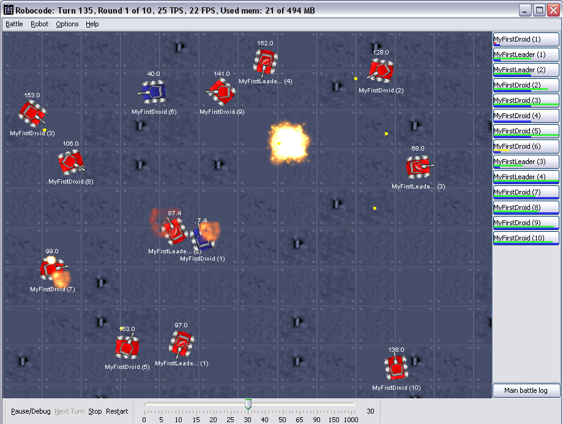
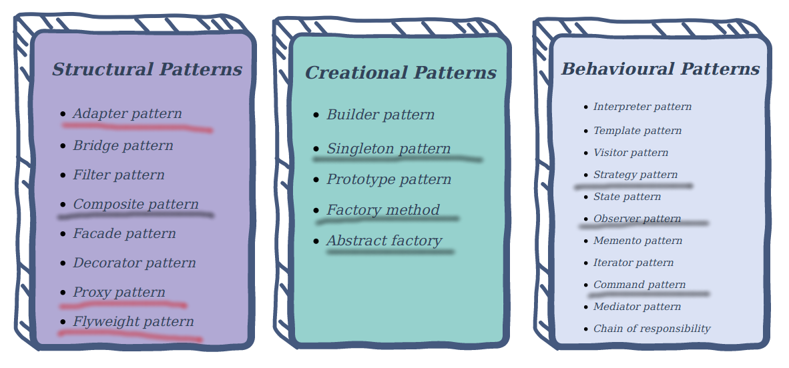
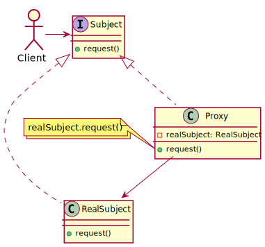
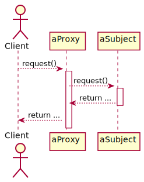
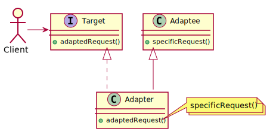
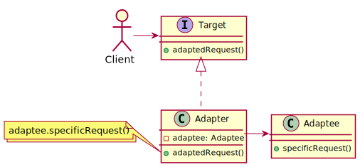
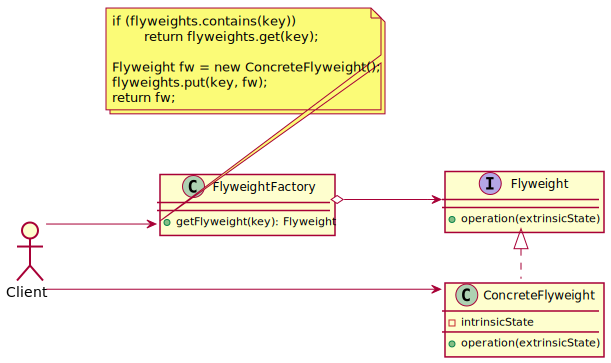

class: title-slide  

# Modul - Fortgeschrittene Programmierkonzepte
### Bachelor Informatik

## 09 - Design Patterns, pt. 3
### Prof. Dr. Marcel Tilly
Fakultät für Informatik, Cloud Computing

---
class: split-50

# Before we start...

## The plan for the 'X-Mas Lecture'

#### Robocode Tournament, Gluehwein and Pizza!

.column[
**Plan**

8:00   --  Introduction Lecture into Robocode

10:00  --  Start Coding and Testing

11:00  --  Tournament starts
]

.column[
.center[]
]

---

# Today in 'Übung 3'

- JavaFX Introduction and Coding Gems

.center[]

---

# Agenda for today

What is on the menu for today?

- Proxy Pattern
- Adapter Pattern
- Flyweight Pattern

.center[]

---

# Proxy - Pattern

#### Proxy is a structural design pattern that lets you provide a substitute or placeholder for another object. A proxy controls access to the original object, allowing you to perform something either before or after the request gets through to the original object.


---

# Proxy

## Example

Consider the following example:

You design a campus app that provides information such as timetables, room plans, cafeteria meal plan, etc.

The class responsible for retrieving the meal plan might look like this:

```java
class Meal {
	String name;
	List<String> notes;
}
```

---

# Proxy

```java
class MensaService {
	interface OpenMensaApi {
		@GET("canteens/229/days/{date}/meals")
		Call<List<Meal>> listMeals(@Path("date") String date);
	}

	OpenMensaApi api;

	MensaService() {
		Retrofit retrofit = new Retrofit.Builder()
			.baseUrl("https://openmensa.org/api/v2/")
			.addConverterFactory(GsonConverterFactory.create())
			.build();
		api = retrofit.create(OpenMensaApi.class);
	}

	List<Meal> getMeals(String date) throws IOException {
		Call<List<Meal>> call = api.listMeals(date);
		Response<List<Meal>> resp = call.execute();
		return resp.body();
	}
}
```

---

# Proxy

## Example

Later in your app, you might use this class as follows:

```java
class SomeApp {
	public static void main(String... args) {
		MensaService ms = new MensaService();

		List<Meal> meals = ms.getMeals("20170612");
	}
}
```

You test your product and observe that students keep looking at the app every 5 minutes in the morning.

Clearly, every request to get the meals of a certain date will result in a subsequent (network) call to the OpenMensa API.

---

# Proxy

## Example

This is unfortunate:

1. the remote server may become unreachable if wifi drops, or slow during "rush hour";

1. second (and more importantly), the information is quite static -- it usually doesn't change!

**What can we do?**

---

# Proxy

## Example

This is where the _proxy_ pattern comes in.
We create a subclass that satisfies the same interface as the base class, but adds caching functionality:

```java
	public static void main(String... args) {
		// anonymous derived class for brevity
		MensaService proxy = new MensaService() {
			Map<String, List<Meal>> cache = new HashMap<>();
			List<Meal> getMeals(String date) throws IOException {
				if (cache.containsKey(date))
					return cache.get(date);
				List<Meal> meals = super.getMeals(date);
				cache.put(date, meals);
				return meals;
			}
		};
		List<Meal> meals = proxy.getMeals("20170612");
	}
```

---

# Proxy

This way, the request for the meal plan of a certain date will only be executed once:

- for subsequent calls, the proxy returns the cached responses.

The fact that the proxy has the same interface allows the client to dynamically select to use the proxy or not.

> Note: Subclassing is one option; more frequently, both the _real_ service and the proxy would implement the same interface, and the proxy would maintain a reference to the real service.

---

# Proxy

## Structure and Participants

.center[]

---

# Proxy

## Sequential Behaviour

.center[]

---

# Proxy

## Variants

- **Remote** proxy (aka. _Ambassador_): Provides local proxy to remote object (different process or physical location)

- **Virtual** proxy: Creates expensive objects on demand; not to be confused with singleton (unique instance)

- **Protection** Proxy: controls access to the original object, e.g. read-only access that simulates write.

---

# Proxy

## Examples

- Caching for network requests.

- Log output routing.

- Lazy initialization of expensive objects.

Related: security facade; behaves like proxy, but hides error handling or authentication.

---

# Proxy

#### Pros

- You can control the service object without clients knowing about it.
- You can manage the lifecycle of the service object when clients don’t care about it.
- The proxy works even if the service object isn’t ready or is not available.
- Open/Closed Principle. You can introduce new proxies without changing the service or clients.

#### Cons

- The code may become more complicated since you need to introduce a lot of new classes.
- The response from the service might get delayed.

---

# Proxy, Decorator and Composite

**Decorator**
Adds functionality without subclassing: one enclosed instance plus extra logic.

**Composite**
Models a recursive structure, such as user interface widgets: arbitrary number of enclosed instances, logic typically restricted to traversing the structure or specific to leaf classe.

**Proxy**
Mimics the original object (!) while adding access control or caching.

- In edge cases, a proxy actually behaves like a decorator (or vice versa).
- Decorators can typically be stacked, often in arbitrary order;
- Proxy hierarchies are typically very flat: either there is a proxy, or there is none.

---

# Adapter - Pattern

#### Adapter is a structural design pattern that allows objects with incompatible interfaces to collaborate.

.center[<iframe width="600" height="400" src="https://www.youtube.com/embed/1cYzkyXp0jg" frameborder="0" allow="accelerometer; autoplay; encrypted-media; gyroscope; picture-in-picture" allowfullscreen></iframe>]


---

# Adapter

### Example


Let's stick with the example above, where you implemented a `MensaService` class that allows you to get the list of meals via `getMeals(String date)`.

e.g. you want to  provide the meals in form of an `Iterable` where you can set the date:

```java
interface MealProvider extends Iterable<Meal> {
	void setDate(String date);
	// Iterator<Meal> iterator();  <-- from Iterable!
}
```

**BUT**

This is quite a different interface, but there is no way that either of you changes their code -- think of all the refactoring of the unit tests etc.!

---

# Adapter

### Example

This is where the _adapter_ pattern comes in.

Just like you use adapters for tools if they don't fit, you can create an adapter that fits both ends:

```java
class MealAdapter extends MensaService implements MealProvider {
	private String date;
	@Override
	public void setDate(String date) { this.date = date; }
	@Override
	public Iterator<Meal> iterator() {
		try {
			return super.getMeals(date).iterator();
		} catch (IOException e) {
			return Collections.emptyIterator();
		}
	}
}
```

---

# Adapter

### Example

Voila, this is your _class adapter_:

```java
MealProvider mp = new MealAdapter();
mp.setDate("20171206");
for (Meal m : mp)
	System.out.println(m);
```

Alternatively, you could write an _object adapter_.

An _object adapter_ implements the target interface, but maintains a reference to an instance of the class to be adapted.

---

# Adapter

## Structure and Participants

### Class Adapter

.center[

]

**How does the _object adapter_ look like?**

---

# Adapter

## Structure and Participants

### Object Adapter

.center[

]

**Best choice if implementation of Adaptee unknown!**

---

# Adapter

### Discussion and Comments

The Adapter is not to be confused with the [Facade](https://en.wikipedia.org/wiki/Facade_pattern), in which a whole subsystem is abstracted into a new class, typically implementing a **new** interface.

An example for a Facade would be to couple the classes `Engine`, `Transmission` and `Starter` into the class `Auto`, which adds the logic on how to start, drive and stop.

---

# Adapter

### Examples

- `ObservableCollection` in JavaFX to bind `List`s to views

- Wrappers for third-party libraries

- _Object_ adapter often best choice if implementation of Adaptee unknown

---

# Adapter

#### Pros

- _Single Responsibility Principle_: You can separate the interface or data conversion code from the primary business logic of the program.
- _Open/Closed Principle_: You can introduce new types of adapters into the program without breaking the existing client code, as long as they work with the adapters through the client interface.

#### Cons

- The overall complexity of the code increases because you need to introduce a set of new interfaces and classes. Sometimes it’s simpler just to change the service class so that it matches the rest of your code.

---

# Flyweight - Pattern

#### **Flyweight** is a structural design pattern that lets you fit more objects into the available amount of RAM by sharing common parts of state between multiple objects instead of keeping all of the data in each object.

.center[]
---

# Flyweight

## Example

Consider the following example: you want to build a "text based" web browser (e.g. for visually impaired).

Here is a simple page that contains a list of a few images.

```html
<ul>
	<li></li>
	<li></li>
	<li></li>
	<li></li>
</ul>
```

---

# Flyweight

## Example


In Java, we could use an `Img` class to represent each image:

```java
class Img {
	final Image image;
	final String caption;

	Img(String caption, String path) throws Exception {
		this.caption = caption;
		File file = new File(getClass().getClassLoader()
				.getResource(path).toURI());
		this.image = ImageIO.read(file);
	}
	void describe(PrintStream ps) {
		ps.println(String.format("%s: %d x %d", caption,
				image.getHeight(null), image.getWidth(null)));
	}
}
```

---

# Flyweight

## Example

You could now instantiate the list with a few image tags and print them to make it a text based browser.

```java
List items = new LinkedList<>();

// allocate items
items.add(new Img("Exhibit 1", "picasso.png"));
items.add(new Img("Exhibit 2", "vangogh.png"));
items.add(new Img("Exhibit 3", "munch.png"));
items.add(new Img("Exhibit 4", "monet.png"));

// print them out
for (Img e : items)
	e.describe(System.out);
```

---

# Flyweight

## Example

This works alright as long as every image is different, but is fairly inefficient if images are displayed _multiple_ times:

```html
<ul>
	<li></li>
	<li></li>
	<li></li>
	<li></li>
</ul>
```

> This may sound hypothetical, but think of recurring images in an endless scroll page such as the "Like" button on Facebook.

---

# Flyweight

## Example

Clearly, re-loading the `picasso.png` is not only inefficient in terms of load times and network traffic, it also has bad effect on memory.

This is where the _Flyweight_ pattern comes into play.
The general idea is to separate 

- **intrinsic** (static, unchanged; here: `picasso.png`) information

from

- **extrinsic** (variable; here: `alt` caption) information.

---

# Flyweight

## Example

The intrinsic share becomes the _flyweight_, and it will be shared among all different `img` that have the same `src`.

```java
class Flyweight {
	// intrinsic state
	private final Image image;

	Flyweight(String path) throws Exception {
		File file = new File(getClass().getClassLoader()
				.getResource(path).toURI());
		// load image (the intrinsic state)
		this.image = ImageIO.read(file);
	}
	void describe(PrintStream ps, Img es) {
		ps.println(String.format("%s: %d x %d",es.caption,
				image.getHeight(null), image.getWidth(null)));
	}
}
```

---

# Flyweight

## Example

These flyweights are managed by a factory; that is, the user never allocates a flyweight manually, but retrieves instances from the factory, which facilitates the sharing.

```java
class FlyweightFactory {
	private Map<String, Flyweight> flyweights = new HashMap<>();

	Flyweight getFlyweight(String path) throws Exception {
		if (flyweights.containsKey(path))
			return flyweights.get(path);

		// allocate new flyweight
		Flyweight fw = new Flyweight(path);
		flyweights.put(path, fw);

		return fw;
	}
}
```

---

# Flyweight

## Example

The extrinsic share becomes the new `Img` class; it will have individual `alt` captions, but maintain references to the shared flyweight.

```java
class Img {
	final String caption;
	final Flyweight flyweight;  // reference!

	Img(String caption, Flyweight flyweight) {
		this.caption = caption;
		this.flyweight = flyweight;
	}

	void describe(PrintStream ps) {
		// inject extrinsic state to flyweight
		flyweight.describe(ps, this);
	}
}
```

---

# Flyweight

## Example

Back to the original example, our text browser.
Instead of allocating the `Img` tags

```java
List items = new LinkedList<>();
FlyweightFactory factory = new FlyweightFactory();

// allocate items
items.add(new Img("Exhibit 1", 
	factory.getFlyweight("picasso.png")));
items.add(new Img("Also Picasso", 
	factory.getFlyweight("picasso.png")));
items.add(new Img("Picasso, too", 
	factory.getFlyweight("picasso.png")));
items.add(new Img("Oh look, Picasso",
	factory.getFlyweight("picasso.png")));

// print them out
for (Img e : items)
	e.describe(System.out);
```

---

# Flyweight

## Example

This way, the `picasso.png` is only loaded once and then shared among all the other `Img` instances.

_As a result_: the application is faster (single loading) and needs less memory (all static data just once).

You can easily try it by loading a few hundreds of images: you will see how much faster (and less memory) the flyweight uses.


---

# Flyweight

.center[]

**Intrinsic state** becomes the _flyweight_.

**Extrinsic state** managed by client; extrinsic state injected.

---

# Flyweight

## Recipe

0. Do you create a lot of objects?
1. Identify what's _intrinsic_ and _extrinsic_ to your class.
2. Move intrinsic parts to _flyweight_, create factory.
3. Reduce original class to extrinsic parts

## Notes

- The term _flyweight_ is misleading: it is _light_ in a sense of _less and static parts_, but often contains the "heavy" objects.
- Often there is no `operation()`, but just a reference to a shared object.
- The flyweight if often used in combination with the composite pattern (hence `operation()`) 

---

# Flyweight

## Examples

- Glyph (letter) rendering for text fields; intrinsic state: true-type fonts (often several MB), extrinsic state: position on screen, scale (size).

- Browser rendering the same media multiple times; intrinsic state: actual media (image, video, audio), extrinsic state: location on screen

- Android `RecyclerView`; intrinsic state: inflated layout of `RecycleView`, extrinsic state: actual contents to be displayed (often nested with further Flyweight).

- Video games rendering/tiling engines; intrinsic state: actual texture or tile, extrinsic state: 3D location and orientation

---

# Flyweight

#### Pros

- You can save lots of RAM, assuming your program has tons of similar objects.

#### Cons

- You might be trading RAM over CPU cycles when some of the context data needs to be recalculated each time somebody calls a flyweight method.
- The code becomes much more complicated. New team members will always be wondering why the state of an entity was separated in such a way.

---

# Design Patterns Summary

There is a total of 23 design patterns described by Gamma _et al._
Throughout this course, we already discussed quite a few of those:

### Creational Patterns

- [Factory and factory method](/08ln-singleton-factory-strategy-command/): Provide an interface for creating families of related or dependent objects without specifying their concrete class.

- [Singleton](/08ln-singleton-factory-strategy-command/): Guarantee _unique_ instance of class, and provide global access.

---

# Design Patterns Summary

### Structural Patterns

- [Adapter](#adapter): Make a piece of software fit your needs.
- [Composite](/07ln-iterator-composite-observer/): Recursive data structure with containers and leaves, to represent part-whole hierarchies; composite lets client treeat objects and compositions uniformly.
- [Decorator](/03ln-inheritance): Add functionality to objects without changing their basic interface.
- [Flyweight](#flyweight): Share common data to support large numbers of similar objects.
- [Proxy](#proxy): Provide a surrogate to allow caching or access control; indistinguishable to the client (same interface).

---

# Design Patterns Summary


### Behavioral Patterns

- [Command](/08ln-singleton-factory-strategy-command/): create objects that can do or undo certain actions; use it to realize undo, macros and transactions.
- [Iterator](/07ln-iterator-composite-observer/): Provide access to elements of aggregate without exposing the underlying structure/representation.
- [Observer](/07ln-iterator-composite-observer/): Subscribe to an object to get notified on state change.
- [State](https://github.com/hsro-inf-prg3/03-inheritance): Allow an object to alter its behavior when its internal state changes; objects will appear to change their class.
- [Strategy](/08ln-singleton-factory-strategy-command/): Define family of algorithms and make them interchangeable.
- [Template method](/03ln-inheritance/): Define skeleton of algorithm/functionality in an operation, deferring certain steps/parts to subclasses.

---

# Final Thought!

.center[]
