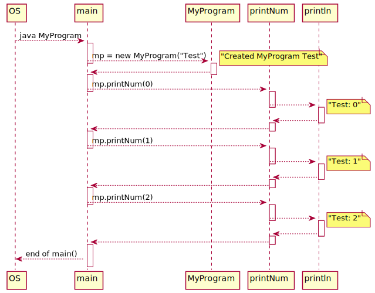
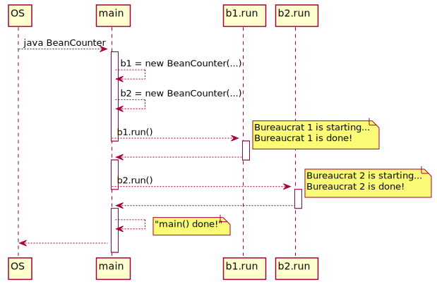
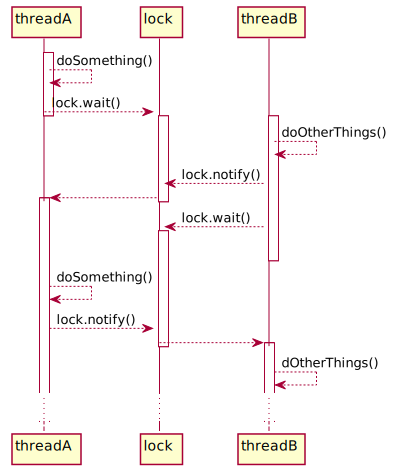

class: title-slide  

# Modul - Fortgeschrittene Programmierkonzepte
### Bachelor Informatik

## 10 - Parallel Processing pt. 1
### Prof. Dr. Marcel Tilly
Fakultät für Informatik, Cloud Computing

---
class: split-50

# Before we start...

## The plan for the 'X-Mas Lecture'

#### Robocode Tournament, Gluehwein and Pizza!

.column[
**Plan**

8:00   --  Introduction Lecture into Robocode

10:00  --  Start Coding and Testing

11:00  --  Tournament starts
]

.column[
.center[]
]

---

# Today in 'Übung 3'

- Linked List and Maps revisited 

.center[]

---

# Agenda for today

What is on the menu for today?

- Parallel Processing
- Threads
- Synchronization
- Communication


---

# Parallel Processing

#### Processes

Up to now, the programs we wrote were basically a single _process_ in which instructions were executed one-by-one, in the order they were written down.
The following code

```java
class MyProgram {
	String name;
	MyProgram(String name) {
		this.name = name;
		System.out.println("Created MyProgram: " + name);
	}
	void printNum(int n) {
		System.out.println(name + ": " + n);
	}
	public static void main(String[] args) {
		MyProgram mp = new MyProgram("Test");
		for (int i = 0; i < 3; i++)
			mp.printNum(i);
	}
}
```

---

# Parallel Processing

#### Processes

Expressed as a sequence diagram, with methods as columns:

.center[]

---
# Parallel Processing

#### Processes

This is also the behavior you see when using the debugger and going through your program step-by-step, using the _step-into_ action.

A _process_ has a self-contained (and isolated) environment.

A Process has a complete and private set of run-time resources; in particular, each process has its own memory space.


---

# Threads

Consider this simple class that models a bean counter.
It receives a name and allocates a large array of numbers; a call to `.run()` sorts the data.

```java
class BeanCounter {

	private final String name;
	private final double[] data;
	
	BeanCounter(String name, int n) {
		this.name = name;
		this.data = new double [n];
	}

	public void run() {
		System.out.println(name + " is starting...");
		Arrays.sort(data);
		System.out.println(name + " is done!");
	}
}
```

---
# Threads

And here is an example program, allocating two bean counters, have them work, and then print a good bye message:

```java
public static void main(String... args) {
	BeanCounter b1 = new BeanCounter("Bureaucrat 1", 10000);
	BeanCounter b2 = new BeanCounter("Bureaucrat 2", 1000);

	b1.run();
	b2.run();

	System.out.println("main() done!");
}
```

**What is the expected result?**

---

# Bean Counters

.center[]

---

# Threaded Bean Counters

- To make the bean counters work in parallel, use the [`Thread` class](https://docs.oracle.com/javase/9/docs/api/java/lang/Thread.html).
- It takes an instance of `Runnable` of which it will execute the `.run()` method _in a separate thread_, once the thread's `.start()` method is called.
- First, modify the `BeanCounter` to implement the `Runnable` interface

```java
public class BeanCounter implements Runnable {
	// ...
}
```

---

# Thread Execution

Pass instances to the `Thread` class constructor:

```java
public static void main(String[] args) {
	BeanCounter b1 = new BeanCounter("Bureaucrat 1", 10000);
	BeanCounter b2 = new BeanCounter("Bureaucrat 2", 1000);

	new Thread(b1).start();
	new Thread(b2).start();

	System.out.println("main() done!");
}
```

---
# Threaded Bean Counters

.center[]

---

# Thread Output

**So, what is the line line of the output?**

a) Bureaucrat 2 is done!

b) Bureaucrat 1 is done!

c) main() done!

Vote on PINGO: https://pingo.coactum.de/007034

ID: **007034**

.center[]


---

# Thread Output

This will likely produce output similar to this:

```
Bureaucrat 1 is starting...
main() done!
Bureaucrat 2 is starting...
Bureaucrat 1 is done!
Bureaucrat 2 is done!
```

- The three methods (`main`, `b1.run` and `b2.run`) were executed in parallel.
- If you run the code on your machine, you may get a different order of the output; this is because only one thread can write to `System.out` at a time, and they may get to that point at different times depending von your number of CPUs etc.

---

# Threads

- Instead of providing a `Runnable` to the `Thread`, you can also extend the `Thread` class and overwrite the `run` method.

- Threads are sometimes called _lightweight processes_; they exist inside processes and have shared resources.
- This allows communication but at the same time introduces risks.

- From your operating systems class, you may already know that there are _user_ and _system_ (or _kernel_) level threads.
- In Java, threads are technically _user level_, since you work with the `java.lang.Thread` API (and the JVM) rather than directly with the operating system.
- For the JVM, however, threads are typically implemented as _kernel level_ threads, to get the best performance; the VM translates the threading instructions into operations native to your operating system.

---

# Threading: Examples

Multi-threaded programming is ubiquitous in modern applications:

- browser: loading multiple resources at a time using concurrent connections

- rendering multiple animations on a page/screen

- handling user interactions such as clicks or swipes

- sorting data using divide-and-conquer

- concurrent network, database and device connections

- ability to control (pause, abort) certain long-lasting processes

---

# Synchronization

## Joining

The example above has one major flaw: the `main()` routine finishes before the actual work is done.
Transferred to the real world, this would mean that you delegate the work to your team, but immediately report that all work is done while your team is still working hard!

---

# Synchronization

## Joining

One (terrible) way to fix this is to _actively wait_ until a thread is done by checking its `.isAlive()` method.

```java
public class Joining implements Runnable {
	@Override
	public void run() {
		System.out.println("Sleeping for 15 seconds");
		Thread.sleep(15000);
	}
	public static void main(String[] args) {
		Thread t = new Thread(new Joining());
		t.start();
		while (t.isAlive())
			;  // do nothing, but really fast...
		System.out.println("Done!");
	}
}
```

---

# Synchronization

## Joining

While this works, this is a terrible idea: the check for `.isAlive()` is really fast, thus the thread executing `main` will run "hot" without doing anything useful.

A much better way to solve this is to use the `.join()` method of `Thread`:

```java
public static void main(String[] args) throws InterruptedException {
	Thread t = new Thread(new Joining());
	t.start();

	t.join();  // block/sleep until t is done
	System.out.println("Done!");
}
```

---

# Synchronization

## Joining

- Note that `join()` (and `sleep()`) may throw an `InterruptedException` which needs to be appropriately handled.

- You can use `join()` whereever you have access to the reference of a thread.

- For example, you could give one thread the reference to another thread, to have it start after the other thread finished.

---

# Synchronisation

### Shared Resources

Imagine you have a number of bean counters in your team, and they should all add to the same counter.

This is possible, since threads share the memory:

```java
class Counter {
	private int c = 0;
	int getCount() { 
		return c; 
	}
	void increment() {
		c = c + 1;
	}
}
```

---

# Synchronisation

### Shared Resources

```java
public class TeamBeanCounter implements Runnable {
	Counter c;
	TeamBeanCounter(Counter c) {
		this.c = c;
	}

	@Override
	public void run() {
		for (int i = 0; i < 100000; i++) {
			c.increment();
		}
		System.out.println("Total beans: " + c.getCount());
	}
}
```

---

# Synchronisation

### Shared Resources

So each `TeamBeanCounter` receives a reference to the shared counter, and in the `run()` method, they each increment the counter by one; once they did this 100000 times, they print the total count.

Thus, this program:

```java
public static void main(String[] args) {
	Counter c = new Counter();

	new Thread(new TeamBeanCounter(c)).start();
	new Thread(new TeamBeanCounter(c)).start();
	new Thread(new TeamBeanCounter(c)).start();
	new Thread(new TeamBeanCounter(c)).start();
}
```

**What is the result of c?**

---

# Pingo again!

**What is the result of c?**

A) < 40.000

B) = 40.000

C) > 40.000

Vote on PINGO: https://pingo.coactum.de/165980 

ID: **165980**

.center[]

---

# Synchronisation

**So what happened?**

All bean counters share the same `Counter` instance; however, since each thread executes its own methods, we need to look at the `increment()` method carefully:

```java
void increment() {
	c = c + 1;
}
```

In fact, to execute this assignment, the JVM needs to first load the value of `c`, then add `1`, and then assign it back to `c`.

```java
void increment() {
	int tmp = c;
	++tmp;
	c = tmp;
}
```

---

# Shared Resources: Inconsistent State!

That means, two threads can be at different steps of this method, but share the memory.
Note that the _stack_ variables are per-thread, whereas the _heap_ variables (the counter instance) are shared (see [Java VM Specifications](https://docs.oracle.com/javase/specs/jvms/se9/html/jvms-2.html#jvms-2.5.2)).

.center[
|   | Thread 1 | Thread 2 | _result_ |
| - | -------- | -------- | -------- |
| 1 | tmp1 = c |          | tmp1 = 0 |
| 2 |          | tmp2 = c | tmp2 = 0 |
| 3 | ++tmp1   |          | tmp1 = 1 |
| 4 |          | ++tmp2   | tmp2 = 1 |
| 5 | c = tmp1 |          | c = 1    |
| 6 |          | c = tmp2 | **c = 1 !** |
]

---

# Synchronization

- To fix this, we need to tell the JVM, which code segment may only entered _by one thread at a time_; 

- This is also called _locking_.

- This is done using the keyword `synchronized`, either as a modifier to the method or as a block instruction.

```java
synchronized void increment() {
	c = c + 1;
}
```
```java
void increment() {
	synchronized (this) {
		c = c + 1;
	}
}
```

---

# Synchronisation

Each thread trying to enter the _critical section_ first has to acquire the lock (here: `this`), or wait for it to become available.
The thread then executes all statements inside the synchronized section, before it releases the lock again.

Note that for the block instruction, the argument to `synchronized` defines the _lock_ object; this could be any object, and is implicitly `this` when using `synchronized` as a method modifier.
Using either method, the output of the `TeamBeanCounter` program is as expected:

```
Total beans: 400000
```

---

# Synchronisation

#### Synchronized Methods vs. Lock Objects

- The benefit of `synchronized` methods is, that it is an easy fix to existing code; the downside is that the whole method is locked.

- The benefit of `synchronized (lock) { ... }` is that the locking can be applied to very few (but critical) operations; note that in the above example, a `synchronized (this)` spanning the whole method body is effectively the same as making the method `synchronized`.

- While you can use any object as lock, you must use the the same reference in all relevant places.

---

# Communication

#### Deadlock

The `synchronized` keyword allows us to safely change values which will be read by other threads.
However sometimes this basic mechanism is not enough.
Consider the following scenario:


This is a classic _deadlock_, similar to a Mexican stand-off from the movies:
`threadA` wants to acquire `lock2`, which is currently taken by `threadB`; `threadB` wants `lock1`, which is currently taken by `threadA`.
As a result, nothing happens, the situation is stuck.


---

# Communication

#### Wait-Notify 

When inside a `synchronized` section, you can use the methods `wait()`, `notify()` and `notifyAll()` of the lock to _wait_ in a thread until _notified_ by some other thread.
You can use this mechanism to have workers only be active when they should be:

.center[]

---

# Communication

#### Wait-Notify 

- These methods are parts of the Java threading API and are defined `final` in `Object`

- `notify()` will wake up one (random) other thread; 

- `notifyAll()` will wake up _all_ other waiting threads.

---

# Communication

#### The Consumer-Producer Problem

The classic example to demonstrate how to use `wait()` and `notify()` in combination is the _consumer-producer-problem_: producers store data in a (ring) buffer and consumers take data out of the buffer.
A typical example is a streaming media player: the producer is the decoder that reads encoded data and stores decoded (raw) media in the buffer; the media device (e.g. video player) is the consumer, removing ready-to-render data from the buffer.


---

# Communication

#### The Consumer-Producer Problem

The buffer provides the basic operations `put(T t)` and `T get()`, which should each block if full (put) or empty (get).

```java
class Buffer<T> {
	List<T> buffer = new LinkedList<>();
	final int max = 10;

	synchronized void put(T obj) throws InterruptedException {
		// wait until buffer not full
		while (buffer.size() == 10)
			wait();

		buffer.add(obj);

		// wake up other threads waiting for buffer to change
		notifyAll();
	}
```

---


# Communication

#### The Consumer-Producer Problem

... continued

```java
	synchronized T get() throws InterruptedException {
		// wait until there's something in the buffer
		while (buffer.size() == 0)
			wait();

		T obj = buffer.remove(0);
		
		// wake up other threads waiting for buffer to change
		notifyAll();
		return obj;
	}
}
```

---


# Communication

#### The Consumer-Producer Problem

Now you could have several threads of producers and consumers which call the `get` and `put` methods.
If somebody calls `get` on an empty buffer, it will repeatedly `wait` until there is something in the buffer.
If somebody calls `put` on a full buffer, it will repeatedly `wait` until there is space available.

This works because **only one** thread at a time is allowed within the critical section; this is also the case why `wait` and `notify` can only be called **within a critical section**.

---

# Thread Lifecycle

This is the complete lifecycle of the thread showing the effects of `start()`, `wait()`, `sleep()` and `join()`.

.center[]

---

# Advanced Aspects of Java: Atomic Access

In Java, reads and writes of references and most basic types are _atomic_, i.e. they happen effectively at once.
This does **not** hold for `long` and `double`, where the reads and writes are done in two chunks of 32 bit.
Thus, two competing threads can read/write corrupted/incomplete data.

Use the `volatile` keyword to make any variable read/write atomic.
In certain cases, this may already be enough to synchronize your threads, i.e. a `synchronized` might not be required anymore, since any change on a volatile variable is immediately visible to other threads.
However, `volatile` does not extend to the _operators_, i.e. a increment or decrement operator may still require synchronization.

Final (`final`) fields however, are [thread-safe](https://docs.oracle.com/javase/specs/jls/se9/html/jls-17.html#jls-17.5), since their values don't change.

---

# Further Reading

For more details and examples, refer to the chapter [Concurrency](https://docs.oracle.com/javase/tutorial/essential/concurrency/) of the Oracle Java SE Tutorial.
[Chapter 17 of the Java Language Specification](https://docs.oracle.com/javase/specs/jls/se9/html/jls-17.html) describes the full specifics of Java's threads and locks.

---

# Final Thought!

.center[]
