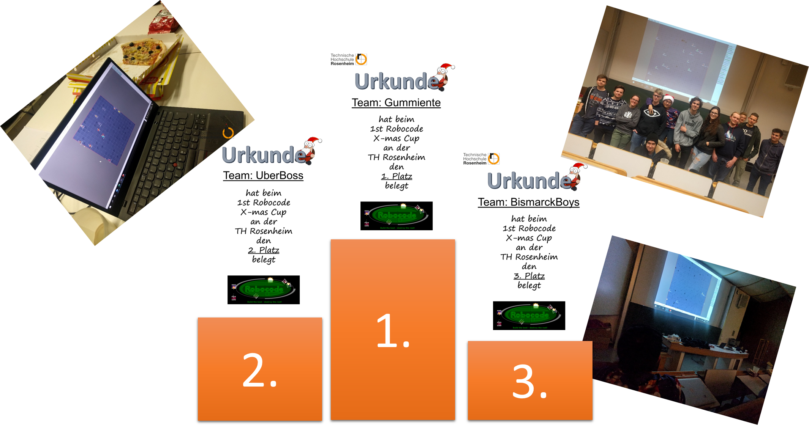

class: title-slide  

# Modul- Fortgeschrittene Programmierkonzepte
### Bachelor Informatik

## 12- Functional Programming
### Prof. Dr. Marcel Tilly
Fakultät für Informatik, Cloud Computing
---

# Roboocode

## 1st Robocode X-Mas Cup

.center[]

---

# Probeklausur

## Zur Vorbereitung:

[Klausur im Learning Campus](https://learning-campus.th-rosenheim.de/pluginfile.php/98264/mod_folder/content/0/Probeklausuren/klausur_INF_FPK_ws19.pdf)

- Allgemeine Fragen
- Generics
- Design Pattern
- Threads
- Functional Interfaces
- Functional Programming
- GIT

Besprechung am 15.1.2020 in Übung 3 (13:15!)

---

# Today in 'Übung 3'

## No requests so far!

---

# Agenda for today!

## Introduction into Functional Programming

.center[]

---

# Functional Programming

[Functional Programming](https://en.wikipedia.org/wiki/Functional_programming) (FP) is a programming paradigm that (re-)gained quite some traction in the past years.

"Functional programming is a style of programming that emphasizes the evaluation of expressions, rather ten execution of commands. The expression in these languages are formed by using functions to combine basic values" - _Graham Hutton, 2002_

Core Elememts of FP are:

- **Purity**: The pure function will return the exact result every time, and it doesn’t mutate any data outside of it.
- **Immutability**: In functional programming, x = x + 1 is **illegal**.
- **Higher-Order Functions**: Functions are treated as objects, therefore we can pass functions around as we would any other value. A higher order function is simply a function that operates on other functions

---

# FP Languages

Populuar functional programming languages these days are:
- [Scala](http://scala-lang.org/)
	- combines object-oriented and functional aspects; executed on the Java VM and can thus integrate seamlessly with any existing Java libraries.
- [JavaScript]()
	- not Java!
	- untyped, functional programming
- [Python](https://www.python.org/)
	- object-oriented and functional
- [Erlang/Elixir](https://elixir-lang.org/)
	- functional and executed in Erlang VM
- [Haskell](https://www.haskell.org/)
	- pure functional and typed
- Others: LISP, Closure, Elm, F#

---

# Detour: Scala

Scala syntax:
- It follows the substitution principle, where the result of the last instruction is the return value.
- It has built-in operators for list operations (head, tail, add, split, etc.)

With **Scala**, _insertion sort_ can be written in just a few lines of code:

.small[
```scala
// to sort a list...
def isort(xs: List[Int]): List[Int] = xs match {
	// an empty list is sorted
	case Nil => Nil
	// a list with a single element is also sorted
	case List(x) => List(x)
	// otherwise, cut off the first element (y) and
	// insert it into the sorted remaining list (ys)
	case y :: ys => insert(isort(ys), y)
}

// to insert an element into a (sorted) list...
def insert(xs: List[Int], x: Int): List[Int] = xs match {
	// if the list was empty, return a new list with just x
	case Nil => List(x)
	// otherwise: cut off the first element of xs and ...
	case y :: ys =>
		if (x < y) x :: xs       // prepend x to xs
		else y :: insert(ys, x)  // insert x into ys
}
```
]

---

# Detour: Haskell

Haskell syntax:
- pure, clean, small.
- Natural built-in operators for list operations (head, tail, add, split, etc.)
- Compiles to binary

With **Haskell**, _insertion sort_ can be written in even fewer lines of code:

.small[
```haskell
insert :: Ord a => a -> [a] -> [a]
insert x [] = [x]
insert x (y:ys) | x < y     = x:y:ys
                | otherwise = y:(insert x ys)

isort :: Ord a => [a] -> [a]
isort [] = []
isort (x:xs) = insert x (isort xs)
```
]

---

# Detour: Elixir

Elixir syntax:
- With scope and module. 
- Natural built-in operators for list operations (head, tail, add, split, etc.)

With **Elixir**, _insertion sort_ is still small:

.small[
```elixir
defmodule Sort do
  def isort(list) when is_list(list), do: isort(list, [])
  def isort([], sorted), do: sorted
  def isort([h | t], sorted), do: isort(t, insert(h, sorted))
 
  defp insert(x, []), do: [x]
  defp insert(x, sorted) when x < hd(sorted), do: [x | sorted]
  defp insert(x, [h | t]), do: [h | insert(x, t)]
end
```
]

---

# Reminder: Java

In **Java** still clean but **hard** to get what the code is doing!

```java
public static void insertSort(int[] A){
  for(int i = 1; i < A.length; i++){
    int value = A[i];
    int j = i - 1;
    while(j >= 0 && A[j] > value){
      A[j + 1] = A[j];
      j = j - 1;
    }
    A[j + 1] = value;
  }
}
```

---

# Text Books

- [Functional Programming in Java](https://www.amazon.de/Functional-Programming-Java-Harnessing-Expressions/dp/1937785467/) by Venkat Subramaniam.

- [Parallel and Concurrent Programming in Haskell](https://www.amazon.de/Parallel-Concurrent-Programming-Haskell-Multithreaded-ebook/dp/B00DWJ1BIG) by Simon Marlow

- [Programming Erlang](https://www.amazon.de/Programming-Erlang-Concurrent-Pragmatic-Programmers/dp/193778553X) by Joe Armstrong

- [Pearls of Functional Algorithm Design](https://www.amazon.de/Pearls-Functional-Algorithm-Design-English-ebook/dp/B009019VUK) by Richard Bird

---

# Functional Programming

#### What the F***!!!

.center[]

---

# FP - Purity

**Pure functions** return a value solely based on what was passed into it, it **doesn’t** modify values outside of its scope, that makes it _independent_ from any state in the system.

- Pure functions operate on their input parameters.
- Pure functions never mutate data.
- Pure functions have no side effects.
- Pure functions will always produce the same output given the same inputs.

```javascript
function justTen() {
    return 10;
}

function square(x) {
    return x * x;
}

function add(x, y) {
    return x + y;
}
```

---

# FP - Impurity

#### Impure functions can create side-effects.

Impure Function:

```javascript
var tip = 0;

function calculateTip( mealTotal ) {
   tip = 0.15 * mealTotal;
}

calculateTip( 150 )
```

**NOTE**: Unfortunatley you use impure functions in functional programming!!!

**Question: Is object-orentation a functional programming paradigm!**

---

# FP - Immutable Objects

**If objects cannot be changed after their creation, parallelization becomes much easier.**

`java.lang.String`
- no methods to change instance
- always returns _new_ instance

`final` modifier for attributes and variable, sort of:
- only prevents overwriting of primitive type or reference
- object may still be mutated

.skip[
> No mutation means no `for`/`while`!]

---

# But back to FP in _Java_.

#### Functions as First-Class Citizens

```java
@FunctionalInterface
interface Function<A, B> {
	B apply(A obj);
}
```

```java
Function<Integer, Integer> square = new Function<Integer, Integer>() {
	@Override
	public Integer apply(Integer i) {
		return i * i;
	}
}
```

---

# Lambda in Java

Or shorter as lambda expression `(arglist) -> { block; }`

```java
Function<Integer, Integer> square = (Integer i) -> { return i * i };
```

Or even shorter, for single instructions

```java
Function<Integer, Integer> square = i -> i * i;
```

- The types are usually automatically inferred.

- For single instructions, you can omit the curly braces and `return`.

---

# Why Functional Programming?

#### So what's the big deal with functional programming?

1. Since objects are immutable, parallization is (almost) trivial (you may have heard of [map-reduce](https://de.wikipedia.org/wiki/MapReduce)).

2. _Separation of Concerns (SoC)_: FP helps you to separate the _data traversal_ (how you _iterate_ the data) from the _business logic_ (what you _do_ with the data).

---

# Example

Say you want to

- retrieve all students from a database,
- filter out those who took _Programmieren 3_,
- load their transcript of records from another database
- print all class names


#### Iterative Solution

```java
for (Student s : getStudents()) {
	if (s.getClasses().contains("Programmieren 3")) {
		ToR tor = db.getToR(s.getMatrikel());
		for (Record r : tor) {
			System.out.println(r.getName());
		}
	}
}
```

---

# A Simple Immutable List

`head` stores the data, `tail` links to the next element.

The end of the list is explicitly modeled.

```java
class List<T> {
	final T head;
	final List<T> tail;

	private List(T el, List<T> tail) {
		this.head = el;
		this.tail = tail;
	}

	boolean isEmpty() {
		return head == null;
	}

	// ...
}
```

---

# Some Helper Functions

Some factory functions for convenience:

.small[
```java
class List<T> {
	// ...

	static <T> List<T> empty() {
		return new List<T>(null, null);
	}

	static <T> List<T> list(T elem, List<T> xs) {
		return new List<>(elem, xs);
	}
	
	static <T> List<T> list(T... elements) {
		if (elements.length == 0)
			return empty();
		int i = elements.length - 1;
		List<T> xs = list(elements[i], empty());
		while (--i >= 0)
			xs = list(elements[i], xs);
		return xs;
	}
}
```
]

---

# Usage

Here's an example usage:

```java
import static List.empty;
import static List.list;

List<Integer> sequence = list(1, 2, 3, 4, 5);
List<Integer> emptyList = empty();
List<Integer> prepend = list(0, empty());

System.out.println(sequence.isEmpty());   // "false"
System.out.println(emptyList.isEmpty());  // "true"
System.out.println(prepend.isEmpty());    // "false"
```

By now, you probably already realized the main issue with this class: once it's initialized, there is no way to change it.
That means: all mutations on this list will have to create a _new_ list.

Even "worse": if variables can't be changed, there is no `for`/`while` iteration!

---

# Recursion

**Bitte nicht zu lange auf diese Slide schauen!!!**

--

.center[]

---

# Easy Recursion

To warm up, let's formulate a recursive `toString()` method for our `List` class.
**Remember:** When writing recursive functions, you need to make sure to capture the _terminal_ cases (the ones where you know the answer) and the _recursion cases_ (the ones where you make the recursive calls).

```java
class List<T> {
	// ...

	/**
	 * Either 'nil' if the list is empty, or 
	 * '( head tail.toString )' otherwise
	 */
	@Override
	public String toString() {
		if (isEmpty()) return "nil";
		else return "(" + head + " " + tail + ")";
	}
}
```

```java
System.out.println(list(7, 3, 1, 3));  // "(7 (3 (1 (3 nil))))"
```

---

# Simple Recursion

Similarly, we can formulate a `contains` method that checks if a list contains an element: Either the `head` matches, or it may be contained in `tail`.

```java
static <T> boolean contains(List<T> xs, T obj) {
	if (xs.isEmpty()) return false;
	else if (xs.head.equals(obj)) return true;
	else return contains(xs.tail, obj);
}
```

The same with the length of a list: An empty list has length zero, any other list is one plus the length of its tail.

```java
static <T> int length(List<T> xs) {
	if (xs.isEmpty()) return 0;
	else return 1 + length(xs.tail);
}
```

---

# Recursion with List Generation

Things become a bit more tricky if we want to mutate lists (or more precicely: get new lists which differ from the old ones).

For example, consider the `take(int i)` and `drop(int i)` functions that return a list with the first `i` or the sublist following the `i`-th element, respectively.


```java
// recursion with list generation
static <T> List<T> take(List<T> xs, int n) {
	if (n <= 0 || xs.isEmpty()) return empty();
	else return list(xs.head, take(xs.tail, n-1));
}

static <T> List<T> drop(List<T> xs, int n) {
	if (n <= 0 || xs.isEmpty()) return xs;
	else return drop(xs.tail, n-1);
}
```

---

# Recursion for with List Appending

Appending to a list recursively is actually similar to the iterative way: 
	if the target list is empty, the new list is the appendix;
	otherwise we make a new list where we keep the head but append to the tail.

```java
static <T> List<T> append(List<T> xs, List<T> y) {
	if (xs.isEmpty()) return y;
	else return list(xs.head, append(xs.tail, y));
}
```

Since we know how to append to a list, list reversal becomes trivial:
	just make a new list of the current head, and append that to the reversal of the tail.

```java
static <T> List<T> reverse(List<T> xs) {
	if (xs.isEmpty()) return xs;
	else return append(reverse(xs.tail), list(xs.head, empty()));
}
```

---

# Insertion Sort

The idea of [insertion sort](https://en.wikipedia.org/wiki/Insertion_sort) is that _inserting_ an element `x` into an already sorted list `xs` trivial: Skip all elements smaller then `x` before inserting.

In our immutable list scenario this means: "Copy" all values while smaller then `x`, then insert `x` and append the remaining list.

The actual insertion sort method then just inserts the head into the sorted remaining list.

.small[
```java
static <T extends Comparable<T>> List<T> isort(List<T> xs) {
	if (xs.isEmpty()) return xs;
	else return insert(xs.head, isort(xs.tail));
}

private static <T extends Comparable<T>> List<T> insert(T x, List<T> xs) {
	if (xs.isEmpty()) return list(x, empty());
	else {
		if (x.compareTo(xs.head) < 0) return list(x, xs);
		else return list(xs.head, insert(x, xs.tail));
	}
}
```
]

---

# Merge Sort

[Merge sort](https://en.wikipedia.org/wiki/Merge_sort) is a _divide-and-conquer_ algorithm where the key idea is that _merging_ two already sorted lists is trivial: Keep adding the smaller of both lists to your result list until all items have been added.

The actual merge sort method then (recursively) splits the input lists into halves until they only contain a single element or none at all -- those are already sorted.

.small[
```java
static <T extends Comparable<T>> List<T> msort(List<T> xs) {
	if (xs.isEmpty()) return xs;            // no element at all
	else if (xs.tail.isEmpty()) return xs;  // only single element
	else {
		int n = length(xs);
		List<T> a = take(xs, n/2);
		List<T> b = drop(xs, n/2);

		return merge(msort(a), msort(b));
	}
}

private static <T extends Comparable<T>> List<T> merge(List<T> xs, List<T> ys) {
	if (xs.isEmpty()) return ys;
	else if (ys.isEmpty()) return xs;
	else {
		if (xs.head.compareTo(ys.head) < 0)
			return list(xs.head, merge(xs.tail, ys));
		else
			return list(ys.head, merge(xs, ys.tail));
	}
}
```
]

---

# Anonymous Classes, Lambda, References

.small[
```java
static <A> void forEach(List<A> xs, Consumer<A> c) {
	if (xs.isEmpty()) return;
	else {
		c.accept(xs.head);
		forEach(xs.tail, c);
	}
}
```
]

And here's a `Consumer` that prints elements to `System.out`:

.small[
```java
List<Integer> xs = list(1, 2, 3, 4);
forEach(xs, new Consumer<Integer>() {
	@Override
	public void accept(Integer i) {
		System.out.println(i);
	}
});

// or shorter with lambda
forEach(xs, i -> System.out.println(i));

// or even shorter with method references
forEach(xs, System.out::println);
```
]

---

# filter

A different yet very frequent use of lists is to filter them by a particular predicate.
The result of `filter` is a list that contains only elements that satisfy some condition.

Let's do this right away with a helper "function", a `Predicate` ([link](https://docs.oracle.com/javase/9/docs/api/java/util/function/Predicate.html))

```java
@FunctionalInterface
interface Predicate<T> {
	boolean test(T t);
}

static <A> List<A> filter(List<A> xs, Predicate<A> p) {
	if (xs.isEmpty()) return xs;
	else if (p.test(xs.head)) return list(xs.head, filter(xs.tail, p_));
	else return filter(xs.tail, p);
}

List<Integer> xs = list(1, 2, 3, 4);
List<Integer> lt3 = filter(xs, i -> i < 3);
```

---

# map

The last functional concept for this class is `map`.
When working with data, you often need to transform one type of data into another.
For example, you might retrieve a list of `Student`, but you actually need only a list of their family names.

That is: given a list of type `Student`, you want a list of type `String`.

.small[
```java
static List<String> familyNames(List<Student> xs) {
	if (xs.isEmpty()) return empty();
	else return list(xs.head.getFamilyName(), familyNames(xs.tail));
}
```
]

Well, this seems fairly generic, doesn't it?
You want to _map_ one object to another, given some [_function_](https://docs.oracle.com/javase/9/docs/api/java/util/function/Function.html).
Let's try this again, with the logic moved to a functional interface:

.small[
```java
@FunctionalInterface
interface Function<A, B> {
	B apply(A a);
}

static <A, B> List<B> map(List<A> xs, Function<A, B> f) {
	if (xs.isEmpty()) return empty();
	else return list(f.apply(xs.head), map(xs.tail, f));
}

List<Student> xs = ...;
List<String> fns = map(xs, s -> s.getFamilyName());
List<String> fns = map(xs, Student::getFamilyName);  // even shorter
```
]

---

# FP in Java: Streams

So far, we did all the exercises with a pretty useless list class.
But `filter`, `map` and `forEach` are essential tools to process data.

In Java, these functional aspects are not attached (and thus limited) to lists, but to a more general concept of (possibly infinite) [_data streams_](https://docs.oracle.com/javase/9/docs/api/java/util/stream/Stream.html).
This is more appropriate, since the data may originate from very different sources: web APIs, database result sets, or plain text files.

We'll talk more about `Stream`s next week, but for now, please take note of the following methods:

- `Stream<T>.filter(Predicate<? super T> p)`
- `Stream<T>.map(Function<? super T, ? extends R>)`
- `Stream<T>.forEach(Consumer<T> consumer)`

In our examples above, the `filter` and `map` methods returned new lists.
Here, these _intermediate_ methods return `Stream`s.
Our `forEach` method had return type `void`; here, this _terminal_ operation also returns `void`.

---

# Example

Recall the (iterative) example from the very top: retrieve a list of students, find those who attended a certain class, and then print out the names of the classes on their transcript of records.

### Iterative Solution (see earlier slide)

```java
for (Student s : Database.getStudents()) {
	if (s.getClasses().contains("Programmieren 3")) {
		Transcript tr = Database.getToR(s.getMatrikel());
		for (Record r : tr)
			System.out.println(r);
	}
}
```


---

# Example

### Functional Solution

```java
Database.getStudents().stream()
	.filter(s -> s.getClasses().contains("Programmieren 3"))
	.map(Student::getMatrikel)
	.map(Database::getToR)
	.flatMap(t -> t.records.stream())  // stream of lists to single list
	.forEach(System.out::println);
```

Isn't that much more precise as the nested `for` loops with `if` and method calls?

---

# Lazy Evaluation

One last word on efficiency.

The stream methods are _lazy_ in a sense that the downstream operations are only applied to the actual results of the previous steps.

To stick with the example above, the `Student::getMatrikel` would only be applied to those who were passed on by `filter`.

In other words: the _terminal_ operation (here: `forEach`) _pulls_ data from the streams, all the way to the originating stream.

---

# Questions!

.skip.center[

]

---

# Final Thought!

.center[]
