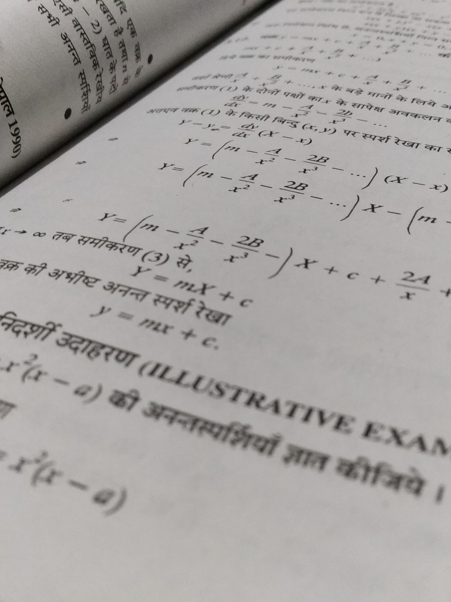
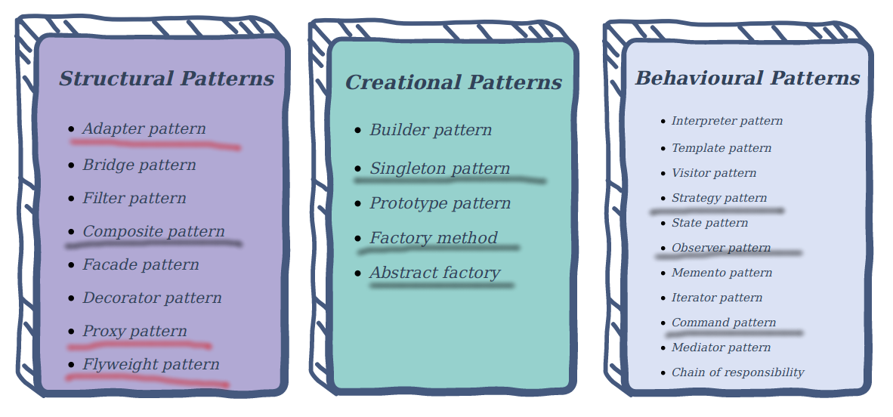

class: title-slide  

# Modul- Fortgeschrittene Programmierkonzepte
### Bachelor Informatik

## 14 - Zusammenfassung
### Prof. Dr. Marcel Tilly
Fakultät für Informatik, Cloud Computing
---

# Today

## Keine Übung

### ABER: Ich werde in S1.31 bis 13:15 sein!

---

# Agenda for today!

### What is hot and what is not!

.right[]

---

# Lernziele

### Aus dem Modulhandbuch

Die Studierenden ...
- ... **vertiefen** ihre Kenntnisse in der objektorientierten Programmierung am Beispiel einer geeigneten Programmiersprache (hier: Java!)
- ... können die Möglichkeiten und Gefahren der objektorientierten Programmierung **beurteilen**.
- ... **sind befähigt**, alle wichtigen Programmierkonzepte für das Programmieren im Großen im Sinne der Komponentenorientierung anzuwenden.
- ... **erarbeiten sich die Grundlagen** der funktionalen Programmierung und deren Anwendungsgebiete.

---

# OOP Paradigm

---

# Information Hiding

- _Information hiding_ (or _encapsulation_) is a fundamental concept in object-oriented programming.

- In Java, this is realized using
 - _interfaces_ (keyword `interface`): describe the externals of modules
 - _classes_ (keyword `class`): encapsulate information (variables) and business logic (methods).

- Also, grouping information and algorithms to coherent modules

---

# Implements vs. Extends

```java
class Rectangle extends Shape implements Drawable {
	private int width, height;
	Rectangle(int x, int y, int w, int h) {
		super(x, y);
		width = w;
		height = h;
	}
	public void draw(Canvas c) { /* do some magic */ }
}
```

- The `Rectangle` literally `extends` a general `Shape`: aside from `x` and `y` coordinates, it is defined by `width` and `height`.

- The `Rectangle` also `implements Drawable`: given some `Canvas`, it can draw itself.

---

# When to use what?

Following the semantics of the keywords, you should

- _extend_ a class, when you aim to make something more specific; a `Rectangle` will always be a `Shape`.
- _implement_ an interface, when you aim to extend a class by certain (potentionally orthogonal) functionality; not every `Shape` might be drawable, and there might be other classes which happen to be drawable.

---

# Multiple Inheritance

One solution is to define `Van` and `Pickup` as `interface`:

```java
interface Van {
	void board(Person p);
	void unboard(Person p);
}
```
```java
interface Pickup {
	void load(Cargo c);
	void unload(Cargo c);
}
```
```java
class VwTransporterPickup implements Van, Pickup {
	List passengers, cargos;
	void board(Person p) {
		passengers.add(p);
	}	// ...
}
```

But this requires us to implement all the methods explicitly!

---

# Multiple Inheritance

The solution: Use `default` methods in the `interfaces`, along with abstract methods that give access to the attributes.

```java
interface Van {
	List getPersons();
	default void board(Person p) {
		getPersons().add(p);
	}
	// ...
}
```
```java
class VwTransporterPickup implements Van, ... {
	private List persons;
	public List getPersons() {
		return persons;
	}
	// ...
}
```

---

# The Diamond Problem

```java
class Bottom implements Left, Right {
	public void method() {
		System.out.println("Bottom.method()");
		Left.super.method();
		Right.super.method();
	}

	public static void main(String... args) {
		Bottom b = new Bottom();
		b.method();
	}
}
```

- The interfaces `Left` and `Right` add default implementations for `method()`.
- Use `super.<method>` to access the implementation of a **base class**, but use `<Interface>.super.<method>` to access default methods.

Note that commenting out `Bottom.method()` will lead to a compiler error!

---

# Mixins

- **MixIn programming** is a style of software development where units of functionality are created in a class and then mixed in with other classes (see **Aspect Oriented Programming**).

- A mixin class is a parent class that is inherited from - but not as a means of specialization. Typically, the mixin will export services to a child class, but no semantics will be implied about the child "being a kind of" the parent.

- MixIn can provide other services based on the services the original class provides.


.footnote[taken from http://wiki.c2.com/?MixIn]

---

# Mixins in Java

[Last week](/04ln-generics-1/), we showed how we can use default methods in interfaces to augment classes by certain functionality:


Use `default` methods!

```java
public `interface` Escalated {
	String getText();
	`default` String escalated() {
  		return getText.ToUpper();
	}
}
public class Message `implements Escalated` {
	private String m;
	public Message(String m) { this.m = m; }

	public String getText() {
		return m;
	}
}
Message m = new Message("Hello World");
System.out.println(`m.escalated()`);       // "HELLO, WORLD"
```

---

# Stateful Mixins

Conceptually, the difference between inheritance and mixins is that the latter are meaningless on its own and can be attached to other unrelated classes.

On the other hand, inheritance is used if there is a strong relation between the classes.

The main issue with the above realization of mixins is the lack of _state_: since the interfaces cannot have attributes, the only way to read/write data would be through (`public`) setters/getters.

Example:
Let's say, you want to gradually escalate your shouting.

```java
Message m = new Message("Hello, World");
m.escalate();  // "HELLO, WORLD"
m.escalate();  // "HELLO, WORLD!"
m.escalate();  // "HELLO, WORLD!!"
m.escalate();  // "HELLO, WORLD!!!"
```

---

# Generics

Instead of using `Object` along with type casts, use type parameters (type variables) as placeholder for actual types, i.e. instead of `Object`, use `T`.
The type parameters need to be declared in the signature of the class, in `<...>` and between the name and the opening curly parenthesis:

```java
interface Map<K, V> {
	void put(K key, V value);
	V get(K key);
}
```

While you could use any identifier for the type parameters, it is customary to use single letters.
Use `T` for a single type, `K` and `V` for key and value, `R` and `S` for unrelated types (see towards the end of this class).
If you need to use multiple type parameters, separate them with comma.

---

# Generic Methods

For methods, the type parameters are specified prior to the return type, and type parameters can be used both for arguments and return types.

```java
class Example {
	static <T> T[] reverse(T[] in) {
		T[] clone = in.clone();
		for (int i = 0; i < in.length/2; i++)
			swap(clone, i, in.length - 1 - i);
		return clone;
	}
	private static <T> void swap(T[] arr, int i, int j) {
		T h = arr[i];
		arr[i] = arr[j];
		arr[j] = h;
	}
	public static void main(String... args) {
		Integer[] arr = {1, 2, 3, 4, 5};
		Integer[] rev = reverse(arr);  // type safety at compile time!
		// will produce error at compile time! (Integer[] and String[] incompatible)
		Integer[] oha = (Integer[]) reverse(
            new String[] {"Hans", "Dampf"});
	}
}
```

---

# Bounds

To enforce that a certain class is either a subclass or implements a certain interface, use the following syntax with `extends`:

```java
class SortedMapImpl<K extends Comparable<K>, V> 
	implements Map<K, V> {
	// ...
}
```

This has two effects: 

- First, the type to be used for `K` is checked at compile time if it implements `Comparable<K>`.
- Second, since `K` implements the interface, you can call any method inherited from `Comparable` on a reference of `K` without an explicit cast.

---

# Comparable<K>

```java
class SortedMapImpl<K extends Comparable<K>, V> implements Map<K, V> {
	// ...
	public V get(K key) {
		Entry it = root;
		while (it != null) {
			// no cast necessary!
			int c = key.compareTo(it.key);
			if (c == 0) return it.value;
			else if (c < 0) it = it.left;
			else it = it.right;
		}
	}
}
```

- To enforce more than one class or interface, use the `&` symbol (since the `,` is already reserved for multiple type arguments), for example: `<T extends Comparable<T> & Serializable>`.
- As you can see in the example above, you may set these _bounds_ on type variables also when extending an interface or class.
- Read more on [type bounds in the Java docs](https://docs.oracle.com/javase/tutorial/java/generics/bounded.html).

---

# Wildcards and Bounds

Consider this routine that prints out all elements of a `java.util.Collection`.

```java
void print(Collection c) {
	for (Object o : c) {
		System.out.println(o);
	}
}
```

Using the raw type is not advised, so we change the signature to

```java
void print(Collection<Object> c) {
	// ...
}
```

---

# Wildcard: ?

- Which is not the supertype for all kinds of `Collection`s?
- What is the supertype of all `Collection`s?

It is a `Collection` with _unknown_ type, which is denoted using the wildcard `?`:

```java
void print(Collection<?> c) {
	for (Object o : c) {
		System.out.println(o);
	}
}
```

---

#  Wildcard as Bound

- inside `print()`, we can _read_ the objects
- but we cannot add to the collection:

```java
void print(Collection<?> c) {
	for (Object o : c) {
		System.out.println(o);
	}
	c.add(new Object());  // compile time error: type error
}
```

---

# Generics 'extends'

- Since we don't know what the element type of `c` stands for, we cannot add objects to it. 
- The `add()` method takes arguments of type the collection is bound to. 
- Any parameter we pass to `add` would have to be a subtype of this now unknown (`?`) type.
- Since we don't know what type that is, we cannot pass anything in.
- An exception is `null`, which is a member of every type.

Similar to type variables, wildcards can be bound.

```java
class Klass {
	void method() { /* ... */ }
}
```
```java
void apply(Collection<? extends KlassA> c) {
	for (Klass k : c) {
		k.method();
	}
}
```

---

# Upper Bound

#### An _upper_ bound, defining that the class is unknown, but _at least_ satisfies a certain class or interface.

For example, `List<Integer>` fits as a `List<? extends Number>`.


What is the difference between a wildcard bound and a type parameter bound?

1. A wildcard can have only one bound, while a type parameter can have several bounds (using the `&` notation).
1. A wildcard can have a _lower_ or an upper bound, while there is no such thing as a lower bound for a type parameter.

---

# Lower Bounds

So what are _lower_ bounds?

#### A lower bounded wildcard restricts the unknown type to be a specific type or a supertype of that type.

In the previous examples with _upper bounds_, we were able to _read_ (`get()`) from a collection, but not _write_ (`add()`) to a collection.
If you want to be able to _write_ to a collection, use a _lower_ bound:

```java
void augment(List<? super Klass> list) {
	for (int i = 1; i <= 10; i++) {
		list.add(new Klass());  // this works
	}
	// compile time error: can't resolve type
	Klass k = list.iterator().next(); 
	// runtime hazard: ClassCastException 
	Klass k = (Klass) list.iterator().next();  
}
```

---

# Liskov Substitution

#### **Definition**: Liskov Substitution Principle: 

```
if S is a subtype of T, 
then objects of type T may be replaced with objects of type S.
```

Within the type system of a programming language, a typing rule

- **Covariant**: if it preserves the ordering of types (≤), which orders types from more specific to more generic
- **Contravariant**: if it reverses this ordering;
- **Invariant or nonvariant**: if neither of these applies.

---

# PECS

Languages supporting generics (such as Java or Scala, and to some extent C++), feature _covariance_ and _contravariance_, which are best described in the following diagram by [Oleg Shelajev at RebelLabs](https://zeroturnaround.com/rebellabs/java-generics-cheat-sheet/) (based on a diagram by [Andrey Tyukin](https://stackoverflow.com/users/2707792/andrey-tyukin) available under the CC-BY-SA).

.center[]

---

# PECS

**Case 1**: You want to go through the collection and do things with each item.

- The list is a **producer**, so you should use a `Collection<? extends Thing>`.
- The reasoning is that a `Collection<? extends Thing>` could hold any subtype of Thing, and thus each element will behave as a Thing when you perform your operation. 
- You actually cannot add anything to a `Collection<? extends Thing>`, because you cannot know at runtime which specific subtype of Thing the collection holds.

**Case 2**: You want to add things to the collection.

- The list is a **consumer**, so you should use a `Collection<? super Thing>`.
- The reasoning here is that unlike `Collection<? extends Thing>`, `Collection<? super Thing>` can always hold a Thing no matter what the actual parameterized type is. 
- Here you don't care what is already in the list as long as it will allow a Thing to be added; this is what `? super Thing` guarantees.

---

# PECS

The combination of the two principles (contravariance and covariance) is known as _PECS_ -- _producer `extends`, consumer `super`_.
The mnemonic is seen from the collection's point of view.

- If you are retrieving items from a generic collection, it is a producer and you should use `extends`.
- If you are adding items, it is a consumer and you should use `super`. 
- If you do both with the same collection, you shouldn't use either `extends` or `super` (but a type variable, with bounds if needed).

The classic example for PECS is a function that reads from one collection and stores them in another, e.g. copy:

```java
static <T> void copy(Collection<? extends T> source, 
	Collection<? super T> dest) {
	for(T n : source) {
		dest.add(n);
	}
}
```

---

# PECS

As you can see, it combines a type variable (`T`) with bounded wildcards to be as flexible as possible while maintaining type safety.

Here is another example, adapted from [a stackoverflow post](https://stackoverflow.com/questions/3486689/java-bounded-wildcards-or-bounded-type-parameter).
Consider this function that adds a Number to a list of Numbers.

```java
static <T extends Number> void includeIfEven(List<T> evens, T n) {
	if (n.intValue() % 2 == 0) {
		evens.add(n);
	}
}
```
```java
List<Number> numbers = new LinkedList<>();
List<Integer> ints = new LinkedList<>();
List<Object> objects = new LinkedList<>();
includeIfEven(numbers, new Integer(4));  // OK, Integer extends Number
includeIfEven(numbers, new Double(4.0)); // OK, Double extends Number
includeIfEven(ints, new Double(4.0));    // type error!
includeIfEven(objects, new Integer(4));  // type error!
```

---

# PECS

As you can see, if the bounds for the type variable (`extends Number`) is satisfied, the same type is used for both arguments.
But the container would actually be more flexible, e.g. a `List<Object>` could also hold those numbers.
This is where the bounds come in:

```java
static <T extends Number> void includeIfEven(List<? super T> evens, T n) {
	// ...
}
```

By using the wildcard with a lower bound on `T`, we can now safely call

```java
includeIfEven(objects, new Integer(4));
includeIfEven(objects, new Double(4.0));
```

---

# Class Diagrams

.center[]

**Association**: References a ...

**Inheritance**: _Is-A_ relation

**Implements**: behavioral relation

**Composition**: real-world whole-part relation

**Aggregation**: "catalog" containment, can exist independently

---

# Design Pattern

.center[]

---

# Threads

- To make the bean counters work in parallel, use the [`Thread` class](https://docs.oracle.com/javase/9/docs/api/java/lang/Thread.html).
- It takes an instance of `Runnable` of which it will execute the `.run()` method _in a separate thread_, once the thread's `.start()` method is called.
- First, modify the `BeanCounter` to implement the `Runnable` interface

```java
public class BeanCounter implements Runnable {
	// ...
}
```

---

# Threading

#### The Consumer-Producer Problem

The buffer provides the basic operations `put(T t)` and `T get()`, which should each block if full (put) or empty (get).

```java
class Buffer<T> {
	List<T> buffer = new LinkedList<>();
	final int max = 10;

	synchronized void put(T obj) throws InterruptedException {
		// wait until buffer not full
		while (buffer.size() == 10)
			wait();

		buffer.add(obj);

		// wake up other threads waiting for buffer to change
		notifyAll();
	}
```

---

# Threading

#### The Consumer-Producer Problem

... continued

```java
	synchronized T get() throws InterruptedException {
		// wait until there's something in the buffer
		while (buffer.size() == 0)
			wait();

		T obj = buffer.remove(0);
		
		// wake up other threads waiting for buffer to change
		notifyAll();
		return obj;
	}
}
```

---

# Parallel Processing

#### Working Asynchronously

A possible solution is to store both arguments and results inside the thread or `Runnable`, and relay possible exceptions to whoever tries to retrieve the result.

.small[
```java
public class JobWithResult implements Runnable {
	private int a, b, result;
	private Exception e;

	JobWithResult(int a, int b) {
		this.a = a;
		this.b = b;
	}

	@Override
	public void run() {
		try {
			this.result = a / b;
		} catch (Exception e) {
			this.e = e;
		}
	}

	int getResult() throws Exception {
		if (e != null)
			throw e;
		return result;
	}
}
```
]

---

# Callables, Futures and Executors since Java 5

Since Java 5, these three parts are realized as [Callable](https://docs.oracle.com/javase/8/docs/api/java/util/concurrent/Callable.html) (1), [Executor](https://docs.oracle.com/javase/8/docs/api/java/util/concurrent/Executor.html) (2) and [Future](https://docs.oracle.com/javase/8/docs/api/java/util/concurrent/Future.html) (3).
The "real" interfaces are slightly different to allow a more faceted use.

.small[
```java
interface Callable<V> {
	V call();
}
```
```java
interface Future<V> {
	boolean cancel(boolean mayInterruptIfRunning);
	V get();
	V get(long timeout, TimeUnit unit);
	boolean isCancelled();
	boolean isDone();
}
```
```java
interface ExecutorService extends Executor {
	void execute(Runnable command);  // for convenience
	<T> Future<T> submit(Callable<T> task);
	Future<?> submit(Runnable task);
	<T> Future<T> submit(Runnable task, T result);
	// ...
}
```
]

---

# Why Functional Programming?

#### So what's the big deal with functional programming?

1. Since objects are immutable, parallization is (almost) trivial (you may have heard of [map-reduce](https://de.wikipedia.org/wiki/MapReduce)).

2. _Separation of Concerns (SoC)_: FP helps you to separate the _data traversal_ (how you _iterate_ the data) from the _business logic_ (what you _do_ with the data).

---

# Example

Say you want to

- retrieve all students from a database,
- filter out those who took _Programmieren 3_,
- load their transcript of records from another database
- print all class names


#### Iterative Solution

```java
for (Student s : getStudents()) {
	if (s.getClasses().contains("Programmieren 3")) {
		ToR tor = db.getToR(s.getMatrikel());
		for (Record r : tor) {
			System.out.println(r.getName());
		}
	}
}
```

---

# A Simple Immutable List

`head` stores the data, `tail` links to the next element.

The end of the list is explicitly modeled.

```java
class List<T> {
	final T head;
	final List<T> tail;

	private List(T el, List<T> tail) {
		this.head = el;
		this.tail = tail;
	}

	boolean isEmpty() {
		return head == null;
	}

	// ...
}
```

---

# FP

#### Reduction

Working on lists (and later streams), we defined three main methods:

- `filter` utilizing a `Predicate<T>` to retain only certain elements,

- `map` utilizing a `Function<T, R>` to transform a list of elements of type `T` to a list of type `R`

- `forEach` utilizing a `Consumer<T>` that accepts (in order of the list).

Working on lists, we defined those _recursively_:

```java
static <T> List<T> filter(List<T> xs, Predicate<T> p) {
	if (xs.isEmpty()) return xs;
	else if (p.test(xs.head)) return list(xs.head, filter(xs.tail, p));
	else return filter(xs.tail, p);
}
```

---

# FP Recap

**Can we remember how to formuate `map` and `forEach`:**

--

Here:
```java
static <A, B> List<B> map(List<A> xs, Function<A, B> f) {
	if (xs.isEmpty()) return empty();
	else return list(f.apply(xs.head), map(xs.tail, f));
}
```

--

```java
static <A> void forEach(List<A> xs, Consumer<A> c) {
	if (xs.isEmpty()) return;
	else {
		c.accept(xs.head);
		forEach(xs.tail, c);
		// return (added for clarity)
	}
}
```

---

# Tail recursion

Alternative:

```java
static int sum(List<Integer> xs, int z) {
	if (xs.isEmpty()) return z;
	else return sum(xs.tail, z + xs.head);
}
```

which evaluates to

```
sum(list(1, 3, 3, 7), 0)
-> sum(list(3, 3, 7), 0 + 1)
-> sum(list(3, 7), 1 + 3)
-> sum(list(7), 4 + 3)
-> sum(empty(), 7 + 7)
-> 14
```

Depending on the language, they can be realized as a for-loop reusing the stack variables.

---

# Reduce

Let's isolate the operation, using the interface `java.util.function.BinaryOperator<T>`:

```java
interface BinaryOperator<T> {
	T apply(T t1, T t2);
}
```
```java
static <T> T reduce(List<T>, T z, BinaryOperator<T> op) {
	if (xs.isEmpty()) return z;
	else return reduce(xs.tail, op.apply(z, xs.head), op);
}
```

---

# Left Fold

We need a function that takes a `BigInteger` (the accumulator), adds an `Integer`, and returns a `BigInteger`.

We'll do so with the interface `java.util.function.BiFunction<T, U, R>` (but tying `T` and `R`), and naming it `foldl` (read: _fold left_).

```java
static <T, R> R foldl(List<T> xs, R z, BiFunction<R, T, R> op) {
	if (xs.isEmpty()) return z;
	else return foldl(xs.tail, op.apply(z, xs.head), op);
}
```
```java
foldl(xs, BigInteger.ZERO, (b, i) -> b.add(BigInteger.valueOf(i)));
```

---

# Left Fold

The function is called _left fold_, since the list is folded _to the left_, if you were to look at the evaluation:

```java
foldl(list(1, 3, 3, 7), 0)
-> foldl(list(3, 3, 7), 0+1)
-> foldl(list(3, 7), 1+3)
-> foldl(list(7), 4+3)
-> foldl(empty(), 7+7)
-> 14
```

and visualized that a list, the operations are performed in this order:

```
// start at the bottom left!
        op
       / \
      op  7
     / \
    op  3
   / \
  op  3
 / \
z   1
```

---

# Right Fold

If you isolate the operation (`+` or `.add()`, respectively), you end up with a _right fold_:

```java
static <T, R> R foldr(List<T> xs, R z, BiFunction<T, R, R> op) {
	if (xs.isEmpty()) return z;
	else return op.apply(xs.head, foldr(xs.tail, z, op));
}
```
```java
foldr(list(1, 3, 3, 7), BigInteger.ZERO, 
	(i, b) -> BigInteger.valueOf(i).add(b));  // 14
```

---

# Right Fold

Again, look at the order of operations:

```
 op
 / \
1  op
   / \
  3  op
     / \
    3  op
       / \
      7   z
```

To complete the top most operation, you need decend all the way down the fold.

---

# Streams in Java

### Generation

- `Stream.of(...)` with array or varargs

- `Collection.stream()`, if supported

- `Stream.generate(...)` using a generator

- Popular APIs, e.g. `Pattern.compile("\\W").splitAsStream("hello world");`


.right[]

---

# Streams in Java

### Intermediate Operations

You already know most of the intermediate operations:
- `filter(Predicate<T> p)` removes/skips unwanted elements in the stream

- `map(Function<T, R> f)` transforms a `Stream<T>` into a `Stream<R>` using the provided `Function`

- `sorted(Comparator<T> comp)` returns a sorted stream

- `concat(Stream<T> s)` appends another stream

- `distinct()` removes duplicates

- `skip(int n)` and `limit(int n)` skip elements and truncate the stream

---

# Collectors 1/2

Another powerful tool provided by the Java Streams API is `collect` which is a special form of stream reduction.

The idea is to iterate over the stream and pass each element to a _combiner_ that builds up a data structure.
A classic example is to turn a `Stream` into a `List`:

```java
List<Integer> list1 = new LinkedList<>();
Stream.of(1, 3, 3, 7).forEach(i -> list.add(i));

// or shorter, using collect
List<Integer> list2 = Stream.of(1, 3, 3, 7).collect(Collectors.toList()));
```

---

# Collectors 2/2

Java provides a [lengthy list of collectors](https://docs.oracle.com/javase/9/docs/api/java/util/stream/Collectors.html) for your convenience.
Here are a few examples from the docs, most notably `groupingBy` und `partitioningBy`.

.small[
```java
// Accumulate names into a TreeSet
Set<String> set = people.stream()
	.map(Person::getName)
	.collect(Collectors.toCollection(TreeSet::new));

// Convert elements to strings and concatenate them, separated by commas
String joined = things.stream()
	.map(Object::toString)
	.collect(Collectors.joining(", "));

// Compute sum of salaries of employee
int total = employees.stream()
	.collect(Collectors.summingInt(Employee::getSalary));

// Group employees by department
Map<Department, List<Employee>> byDept = employees.stream()
	.collect(Collectors.groupingBy(Employee::getDepartment));

// Compute sum of salaries by department
Map<Department, Integer> totalByDept = employees.stream()
	.collect(Collectors.groupingBy(Employee::getDepartment,
		Collectors.summingInt(Employee::getSalary)));

// Partition students into passing and failing
Map<Boolean, List<Student>> passingFailing = students.stream()
	.collect(Collectors.partitioningBy(s -> s.getGrade() <= 400));
```
]

---

# What is important?

### If there is only one day left ...

- Design Pattern
- Generics
- Recursion
- Functional Programming
- Parallel Programming/ Futures
- Classes/ Interfaces

---

# Final Thought!

#### .

.center[]
