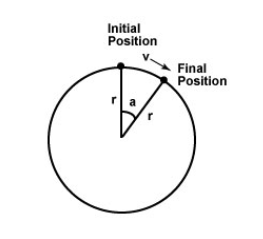

class: title-slide  

# Modul- Fortgeschrittene Programmierkonzepte
### Bachelor Informatik

## X-Mas: Robocode
### Prof. Dr. Marcel Tilly
Fakultät für Informatik, Cloud Computing
---

# What is Robocode?

- **Robocode** is an easy-to-use robotics battle simulator.

- **Robocode** is Open Source

- You create a _robot_, put it onto a battlefield, and let it battle to the bitter end against opponent robots created by other developers.

- **Robocode** comes with a set of pre-fab opponents to get you started, but once you outgrow them, you can enter your creation against the world's best in one of the leagues being formed @ TH Rosenheim.

.center[]

---

# Robocode Package

**Robocode** offers complete development environment
- comes with its own installer
- built-in robot editor
- Java compiler

**Robocode** only pre-requires that a JVM (Java Virtual Machine) to exist already on the system

Everything a robot developer needs to get started is provided with the main Robocode distribution file: `robocode-xxx-setup.jar`

Robocode also supports developing robots using external IDEs like e.g. Eclipse, IntelliJ IDEA, NetBeans, Visual Studio etc.

---

# How to get it?

- Go to https://sourceforge.net/projects/robocode/files/

- Download form `/robocode` the latest `*-setup.jar`

- Run the installer

```shell
$java -jar robocode-1.9.3.7-setup.jar
```

.center[]


---

# Components of Robocode

- When you activate Robocode, you will see two interrelated GUI windows, which form Robocode's IDE they are:

- The **Battlefield** :
	- Where the battle between robots plays out.
	- You can create save and open new or existing battles.
	- Provides statistics of any robot in the arena

- The **Robot Editor** :
	- A text editor for editing Java source code that make up your robot.
	- Create a robot compile it, and you are ready for battle

---

# Anatomy of a Robot

- A **robot** is a graphical tank!

.center[]

- The robot has a rotating gun
- The robot has a rotating radar on top of the rotating gun
- Both can rotate independently in any direction. (**By default they are aligned**)

---

# Anatomy of Robot Code

- All Robots have a class
	- Class name is name of robot

- All extend either `Robot` or `AdvancedRobot`

- All have a `run()`- method

---

# And the code?

Here is where you put your robot commands

```java
package matworx;
import robocode.*;

public class GeneralPatton extends Robot
{
	/**
	 * run: GeneralPatton's default behavior
	 */
	public void run() {
		// Robot main loop
		while(true) {
		}
	}
}
```

---

# What a robot can do?

#### Moving the robot

- `turnRight(double degree)` and `turnLeft(double degree)`
	- Turn the robot by a specified degree.

- `ahead(double distance)` and `back(double distance)`
	- Move the robot by the specified pixel distance; these two methods are completed if the robot hits a wall or another robot.

- `turnGunRight(double degree)` and `turnGunLeft(double degree)`
	- Turn the gun, independent of the vehicle's direction.

- `turnRadarRight(double degree)` and `turnRadarLeft(double degree)`
	- turn the radar on top of the gun, independent of the gun's direction (and the vehicle's direction).

---

# More Commands

- `setAdjustGunForRobotTurn(boolean flag)`
	- If the flag is set to true, the gun will remain in the same direction while the vehicle turns.

- `setAdjustRadarForRobotTurn(boolean flag)`
	- If the flag is set to true, the radar will remain in the same direction while the vehicle (and the gun) turns.

- `setAdjustRadarForGunTurn(boolean flag)`
	- If the flag is set to true, the radar will remain in the same direction while the gun turns. It will also act as if `setAdjustRadarForRobotTurn(true)` has been called.

---

# Obtaining Robot Information

- `getX()` and `getY()`
	- get the current coordinate of the robot.

- `getHeading()`, `getGunHeading()`, and `getRadarHeading()` 
	- get the current heading of the vehicle, gun, or radar in degrees.

- `getBattleFieldWidth()` and `getBattleFieldHeight()`
	- get the dimension of the battlefield for the current round.

---

# Events

#### Events are things that you react to.

In Robocode there are several you can react to:

- ScannedRobotEvent: Handle the ScannedRobotEvent by overriding the `onScannedRobot()` method; this method is called when the radar detects a robot.

- HitByBulletEvent: Handle the HitByBulletEvent by overriding the `onHitByBullet()` method; this method is called when the robot is hit by a bullet.

- HitRobotEvent: Handle the HitRobotEvent by overriding the `onHitRobot()` method; this method is called when your robot hits another robot.

- HitWallEvent: Handle the HitWallEvent by overriding the `onHitWall()` method; this method is called when your robot hits a wall.

---

# First Robot

```java
package matworx;
import robocode.*;

public class MadBot extends Robot
{
    // <<Area 1>>
	// run method
    public void run() {
        ... // <<Area 2>>
        while(true) {
          ... // <<Area 3>>
        }
    }
    ... // <<Area 4>>
    public void onScannedRobot(ScannedRobotEvent e) {
        fire(1);
    }
} 
```

---

# More Code...

```java
package examples;
import robocode.*;

public class Patrol extends Robot{
	/*** run: Patrol's default behavior*/
	public void run() {
		// Fahrzeug nach Norden ausrichten
		turnLeft( getHeading());
		// Kanone nach Norden ausrichten
		turnGunLeft( getGunHeading());
		// Radar nach Norden ausrichten
		turnRadarLeft( getRadarHeading());  

		while(true) {
			ahead( 128);           // Weiterfahren
			turnRadarLeft( 360);   // Rundum Scan durchführen
		}

	}
}
```

---

# ... and more

```java
	/**
	 * onHitWall: What to do when you hit a wall
	 */
	public void onHitWall(HitWallEvent event) { // Gegen Wand gefahren!
		turnLeft(90);        // Linksdrehung um 90 Grad
	} 
 	/**
	 * onScannedRobot: What to do when you see another robot
	 */
	public void onScannedRobot(ScannedRobotEvent e) {
		double b = e.getBearing();  // Zielrichtung auslesen
		turnGunRight( b);           // Kanone auf Ziel
		fire(1);                    // Feuer!
		turnGunLeft( b);            // Kanone wieder in Fahrtrichtung
	}
	/**
	 * onHitByBullet: What to do when you're hit by a bullet
	 */
	public void onHitByBullet(HitByBulletEvent e) {
	}
}
```

---

# Tank Basics: Energy

- Tanks start with a certain amount of health (energy): **100**

- Tanks lose health by:
	- getting shot
	- bumping into things (the walls, other robots)
	- shooting bullets
	- fighting for too long
	- **Note**: tanks that hit each other lose equal amounts of health)

- Tanks gain health by shooting other tanks
- Tanks that run out of health by shooting too much are disabled
	- If the tanks bullet hits a target it can gain energy back


---

# Game Play

#### Point Distribution

- Robots on the field when another robot dies – 50 points
- Last robot alive given extra points – 10 points per dead robot
- Every point of fire damage inflicted on target robot – 1 point
- Every opponent ram – 2 points per damage inflicted by ramming
- Killing a target robot by firing at it– 20% of total damage inflicted
- Death by ramming – 30% of total damage inflicted

.center[]

---

# Tank Basics: Time

- Rotating the gun, radar, and vehicle takes time
	- Vehicle takes the longest amount of time
	- Radar takes the least amount of time

- Bullets take time to hit things (need to shoot where you expect the target to be when the bullet should arrive)

- Gun has a short cooldown period in between shots

- Radar must be pointed at a target to see it
	- Detects velocity, bearing, heading, and energy remaining.

.center[]

---

# Tank Basics: Fire

- 3 levels of firing

	- **fire(1)** – costs the least health, does the least damage

	- **fire(2)**  -costs intermediate health, does intermediate damage

	- **fire(3)** – costs the most health, does the most damage

.center[]

---

# Tank Basics: Radar

- Infinite range

- One degree scan width

- Returns enemy position, orientation, bearing, gun angle, and energy.

- Tank knows its own position, oreintation, bearing, gun angle, and energy

.center[]

---

# Radar Strategies – Seeing other robots

- Locked scanning strategy – radar finds a target and sticks with it
	- Implemented by moving the radar back and forth a little to keep track of the robot, it could scan the direction based on the target robot’s heading
	- Problem: Not good for bigger battles since you could pass by easier to kill robots

- Radar can be used to guess when an opponent’s bullet has fired
	- Any ideas on how we could do this?
	- Look at what we can gather from the radar API

---

# Choosing an Enemy

- **Weakest Enemy** : Pick the guy with the lowest health
	- Problem: This target could be far away. Another robot could dip below target robot’s health in the mean time!

- **Closest Enemy** : Pick the guy closest to you
	- Problem: He could be the winner. Dying earlier means you receive less points overall

- No explicit methods provided by Robocode

---

# Movement Strategies

- None – easy to hit

- Straight line
	- Problem: Easy for enemies to predict

- Curve
	- Problem: Also easy for enemies to predict

- Oscillating

- Random
	- Problem: Run a larger chance of hitting walls

- Anti-gravity
	– keeps the robot from dangerous areas and attracts it toward advantageous areas

These and more discussed here – http://www.dinbedstemedarbejder.dk/Dat3.pdf

---

# Shooting Strategies

- **Linear**
	– Assume that the robot is moving in a straight line, fire at where the robot should be in the time it takes to fire (Assumes constant velocity)
	- All robot motion can be approximated for a short period of time this way

.center[]

---

# Shooting Strategies

#### Circular

- change in x = cos(initialheading) * radius - cos(initialheading + changeinheading) * radius 

- change in y = sin(initialheading + changeinheading) * radius - sin(initialheading) * radius

.center[]

---

# Some Links

- [Download](https://sourceforge.net/projects/robocode/files/)

- [API Doc](https://robocode.sourceforge.io/docs/robocode/)

- [Robocode Wiki](http://robowiki.net/wiki/Robocode/My_First_Robot)

- [Youtube](https://www.youtube.com/results?search_query=robocode)

---

# Rulez

- Every hour we run a _fight_ of 10 rounds

- We will start at 11:00

- Last _fight_ at 16:00

- 6 _fights_ in sum

- Create a team: Team name is package name!

- Use the gitlab repo: https://inf-git.fh-rosenheim.de/inf-fpk/robots

- Check in only class file!

- One class only, no jars!

---

# Comments

- Don't cheat!

- Learn and adjust your strategy!

- Have fun!

---

# Final Thought!

.center[]
